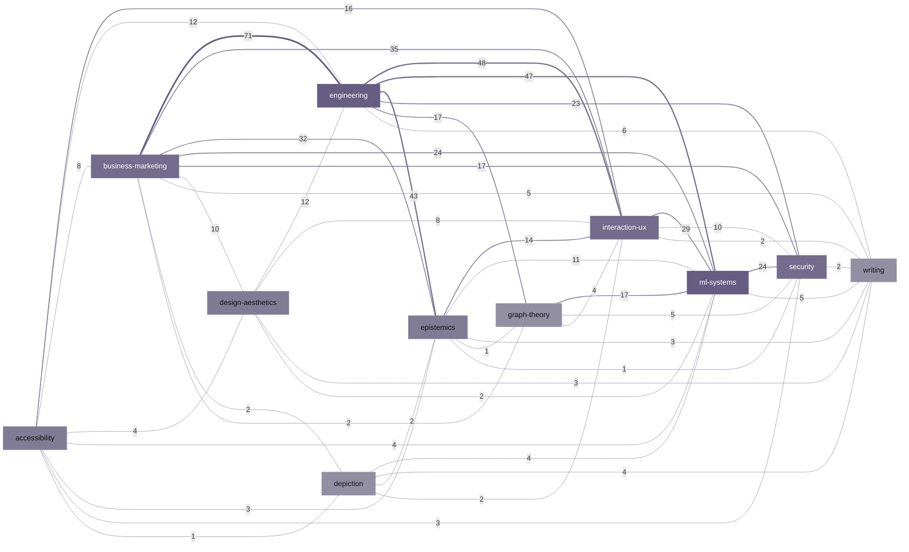

# Rule graph

Rules are nodes. A live `[[ID]]` cross-reference inside a rule row is
an undirected edge. The eleven files under `lexicons/` are a filing
projection over that graph: each rule lives in one file, but citations
cross file boundaries freely. This page shows the **lexicon quotient**:
one node per lexicon file, with edge weight equal to the number of
directed live cross-lexicon references between the pair.

Generated from the rule corpus on each release; do not edit by hand.
Output is byte-stable: the same corpus produces the same bytes.

## Lexicon quotient

Eleven lexicon nodes, **45** weighted edges. The heaviest edge is **business-marketing** -- **engineering** at weight **71** (directed cross-ref count).

Edge labels on the diagram are those weights. Every edge also appears
in the table below ([A11Y-02]). Node fill is a sequential rule-count
step from the shared repo palette; edge stroke colour and width encode
the same weight (see colour legend).

### Colour legend

Lexicon node fill and edge stroke both use a four-step **sequential** OKLCH magnitude ramp (fixed hue far from force hues, monotone OKLab lightness): lightest = fewest rules / lighter weights, darkest = most rules / heavier weights. Edge weight is also the edge label and a table column; stroke width is a second non-colour channel. Tier is also legible from the per-lexicon node counts in the table below.

| Step | Fill | OKLCH (L, C, h) | Rule-count rank |
|---:|---|---|---|
| 0 | `#938FA3` | 0.66, 0.030, 295° | fewest rules (e.g. depiction, graph-theory, writing) |
| 1 | `#817C96` | 0.60, 0.040, 295° | lower mid (e.g. accessibility, design-aesthetics, epistemics) |
| 2 | `#736C8C` | 0.55, 0.050, 295° | upper mid (e.g. business-marketing, interaction-ux, security) |
| 3 | `#655D82` | 0.50, 0.060, 295° | most rules (e.g. engineering, ml-systems) |

### Weighted edges

| lexicon A | lexicon B | directed cross-ref weight |
|---|---|---|
| business-marketing | engineering | 71 |
| engineering | interaction-ux | 48 |
| engineering | ml-systems | 47 |
| engineering | epistemics | 43 |
| business-marketing | interaction-ux | 35 |
| business-marketing | epistemics | 32 |
| interaction-ux | ml-systems | 29 |
| business-marketing | ml-systems | 24 |
| ml-systems | security | 24 |
| engineering | security | 23 |
| business-marketing | security | 17 |
| engineering | graph-theory | 17 |
| graph-theory | ml-systems | 17 |
| accessibility | interaction-ux | 16 |
| epistemics | interaction-ux | 14 |
| accessibility | engineering | 12 |
| design-aesthetics | engineering | 12 |
| epistemics | ml-systems | 11 |
| business-marketing | design-aesthetics | 10 |
| interaction-ux | security | 10 |
| accessibility | business-marketing | 8 |
| design-aesthetics | interaction-ux | 8 |
| engineering | writing | 6 |
| business-marketing | writing | 5 |
| graph-theory | security | 5 |
| ml-systems | writing | 5 |
| accessibility | design-aesthetics | 4 |
| accessibility | ml-systems | 4 |
| depiction | ml-systems | 4 |
| depiction | writing | 4 |
| graph-theory | interaction-ux | 4 |
| accessibility | epistemics | 3 |
| accessibility | security | 3 |
| design-aesthetics | writing | 3 |
| epistemics | writing | 3 |
| business-marketing | depiction | 2 |
| business-marketing | graph-theory | 2 |
| depiction | epistemics | 2 |
| depiction | interaction-ux | 2 |
| design-aesthetics | ml-systems | 2 |
| interaction-ux | writing | 2 |
| security | writing | 2 |
| accessibility | depiction | 1 |
| epistemics | graph-theory | 1 |
| epistemics | security | 1 |

## Intra-lexicon vs cross-lexicon edges

Of **1061** simple undirected edges among rules, **493** stay inside one lexicon file and **568** cross a file boundary (cut ratio **0.54** = cross / (intra + cross)).

**Reading A.** If the eleven lexicons were natural communities of the
citation graph, most edges would fall inside files. A cut ratio of 0.54
says they are not: the file partition is not a low-conductance community
partition. Read alone, that can look like a filing error.

**Reading B (preferred).** This corpus exists to surface cross-domain
convergence. Independent arrivals at the same mechanism are its most
valuable output. Lexicons are a **retrieval** partition, driven by how
agents and people look up rules, not a community partition of the
citation graph. A cut ratio above 0.5 is that purpose showing up in
topology: rules are filed by domain of first arrival and linked by
mechanism. Re-partitioning the files to minimise the cut would hide
the convergences the corpus is built to expose.

## Per-lexicon counts

| lexicon | rule nodes | internal edges | external edges | cut ratio |
|---|---|---|---|---|
| accessibility | 54 | 23 | 48 | 0.68 |
| business-marketing | 109 | 34 | 187 | 0.85 |
| depiction | 15 | 9 | 15 | 0.62 |
| design-aesthetics | 74 | 12 | 39 | 0.76 |
| engineering | 301 | 138 | 257 | 0.65 |
| epistemics | 83 | 41 | 110 | 0.73 |
| graph-theory | 39 | 16 | 46 | 0.74 |
| interaction-ux | 91 | 33 | 157 | 0.83 |
| ml-systems | 208 | 109 | 167 | 0.61 |
| security | 122 | 76 | 80 | 0.51 |
| writing | 46 | 2 | 30 | 0.94 |

Internal and external counts are over simple undirected rule edges.
Cut ratio is external / (internal + external) for that lexicon's
incident edges.

Underlying rule graph (not drawn here): **1142** rule nodes, **1061** distinct undirected edges (simple 1061 + self-loops 0).

