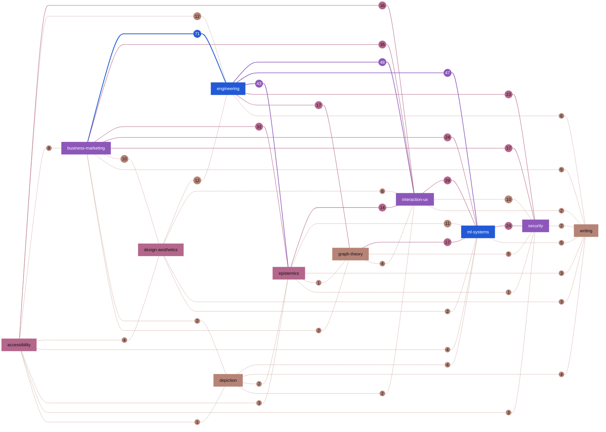
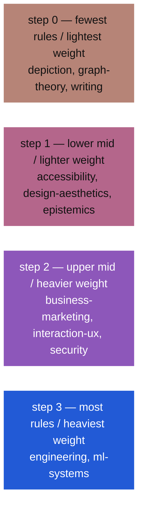

# Rule graph

Rules are nodes. A live `[[ID]]` cross-reference inside a rule row is
an undirected edge. The eleven files under `lexicons/` are a filing
projection over that graph: each rule lives in one file, but citations
cross file boundaries freely. This page shows the **lexicon quotient**:
one node per lexicon file, with each edge weighted by how many rule
citations run between that pair of files (see *Weighted edges*).

Generated from the rule corpus on each release; do not edit by hand.
Output is byte-stable: the same corpus produces the same bytes.

## Lexicon quotient

Eleven lexicon nodes, **45** weighted edges. The heaviest edge is **business-marketing** -- **engineering**, with **71** citations between them.

Each edge weight is a **circle** on the path between two lexicon
**rectangles** (mermaid has no circular edge-label form on GitHub).
Every edge also appears in the table below ([A11Y-02]). Lexicon fill is
a sequential rule-count step from the shared repo palette; weight-circle
fill, edge stroke colour, and stroke width encode the same weight (see
colour legend). All **45** weighted pairs are drawn — nothing is omitted.

### Colour legend

Lexicon node fill, weight-circle fill, and edge stroke share one four-step **sequential** ramp: lightest = fewest rules / lighter edge weights, darkest = most rules / heavier weights. **Rectangles** are lexicon nodes; **circles** on a path are edge weights (citation counts). The swatches below are painted by the same `classDef` lines the diagram uses, so they are the colours, not a description of them.

**Colour is never the only channel.** Every edge weight is also printed inside its circle and listed in the table below, and stroke width carries it a third time; every lexicon node's tier is recoverable from the rule counts in *Per-lexicon counts*. Delete the colour and the page loses no information ([A11Y-02]).

The ramp is derived, not picked: OKLab lightness starts at 0.66 and falls by 0.05 per step; chroma starts at 0.065 and rises by 0.045; hue starts at 35° and turns -44° per step (132° arc). Falling lightness is what makes the order survive greyscale and colour-vision deficiency — the hue rotation rides on top of a value scale rather than carrying the ordering itself.

### Weighted edges

**What the weight counts.** Every `[[ID]]` written inside a rule row is
one citation, and a citation points somewhere: the rule that contains it
names the rule it depends on. An edge weight here is simply **how many
of those citations run between the two files**, counted in both
directions and added together.

The heaviest edge, `business-marketing` -- `engineering` at **71**, therefore says: 71 separate `[[ID]]` citations sit in one of those two files and name a rule in the other.

"Directed" is doing one job in that sentence: if two rules cite *each
other*, that is **two** citations, not one. They arrived at each other
independently, from opposite sides, and the weight says so.

That is the whole reason two numbers on this page disagree. There are **598** cross-lexicon citations but only **568** cross-lexicon *edges*, because **30** pairs of rules cite each other — one edge, two citations. 568 + 30 = 598, exactly.

**How to read a heavy edge.** It is not a defect and not a merge
candidate. A heavy edge means two domains keep reaching for each other's
rules — the cross-domain convergence this corpus exists to surface. A
light edge means the two vocabularies are largely independent, which is
equally informative and much less common.

| lexicon A | lexicon B | citations between them |
|---|---|---:|
| [business-marketing](lexicons/business-marketing.md) | [engineering](lexicons/engineering.md) | 71 |
| [engineering](lexicons/engineering.md) | [interaction-ux](lexicons/interaction-ux.md) | 48 |
| [engineering](lexicons/engineering.md) | [ml-systems](lexicons/ml-systems.md) | 47 |
| [engineering](lexicons/engineering.md) | [epistemics](lexicons/epistemics.md) | 43 |
| [business-marketing](lexicons/business-marketing.md) | [interaction-ux](lexicons/interaction-ux.md) | 35 |
| [business-marketing](lexicons/business-marketing.md) | [epistemics](lexicons/epistemics.md) | 32 |
| [interaction-ux](lexicons/interaction-ux.md) | [ml-systems](lexicons/ml-systems.md) | 29 |
| [business-marketing](lexicons/business-marketing.md) | [ml-systems](lexicons/ml-systems.md) | 24 |
| [ml-systems](lexicons/ml-systems.md) | [security](lexicons/security.md) | 24 |
| [engineering](lexicons/engineering.md) | [security](lexicons/security.md) | 23 |
| [business-marketing](lexicons/business-marketing.md) | [security](lexicons/security.md) | 17 |
| [engineering](lexicons/engineering.md) | [graph-theory](lexicons/graph-theory.md) | 17 |
| [graph-theory](lexicons/graph-theory.md) | [ml-systems](lexicons/ml-systems.md) | 17 |
| [accessibility](lexicons/accessibility.md) | [interaction-ux](lexicons/interaction-ux.md) | 16 |
| [epistemics](lexicons/epistemics.md) | [interaction-ux](lexicons/interaction-ux.md) | 14 |
| [accessibility](lexicons/accessibility.md) | [engineering](lexicons/engineering.md) | 12 |
| [design-aesthetics](lexicons/design-aesthetics.md) | [engineering](lexicons/engineering.md) | 12 |
| [epistemics](lexicons/epistemics.md) | [ml-systems](lexicons/ml-systems.md) | 11 |
| [business-marketing](lexicons/business-marketing.md) | [design-aesthetics](lexicons/design-aesthetics.md) | 10 |
| [interaction-ux](lexicons/interaction-ux.md) | [security](lexicons/security.md) | 10 |
| [accessibility](lexicons/accessibility.md) | [business-marketing](lexicons/business-marketing.md) | 8 |
| [design-aesthetics](lexicons/design-aesthetics.md) | [interaction-ux](lexicons/interaction-ux.md) | 8 |
| [engineering](lexicons/engineering.md) | [writing](lexicons/writing.md) | 6 |
| [business-marketing](lexicons/business-marketing.md) | [writing](lexicons/writing.md) | 5 |
| [graph-theory](lexicons/graph-theory.md) | [security](lexicons/security.md) | 5 |
| [ml-systems](lexicons/ml-systems.md) | [writing](lexicons/writing.md) | 5 |
| [accessibility](lexicons/accessibility.md) | [design-aesthetics](lexicons/design-aesthetics.md) | 4 |
| [accessibility](lexicons/accessibility.md) | [ml-systems](lexicons/ml-systems.md) | 4 |
| [depiction](lexicons/depiction.md) | [ml-systems](lexicons/ml-systems.md) | 4 |
| [depiction](lexicons/depiction.md) | [writing](lexicons/writing.md) | 4 |
| [graph-theory](lexicons/graph-theory.md) | [interaction-ux](lexicons/interaction-ux.md) | 4 |
| [accessibility](lexicons/accessibility.md) | [epistemics](lexicons/epistemics.md) | 3 |
| [accessibility](lexicons/accessibility.md) | [security](lexicons/security.md) | 3 |
| [design-aesthetics](lexicons/design-aesthetics.md) | [writing](lexicons/writing.md) | 3 |
| [epistemics](lexicons/epistemics.md) | [writing](lexicons/writing.md) | 3 |
| [business-marketing](lexicons/business-marketing.md) | [depiction](lexicons/depiction.md) | 2 |
| [business-marketing](lexicons/business-marketing.md) | [graph-theory](lexicons/graph-theory.md) | 2 |
| [depiction](lexicons/depiction.md) | [epistemics](lexicons/epistemics.md) | 2 |
| [depiction](lexicons/depiction.md) | [interaction-ux](lexicons/interaction-ux.md) | 2 |
| [design-aesthetics](lexicons/design-aesthetics.md) | [ml-systems](lexicons/ml-systems.md) | 2 |
| [interaction-ux](lexicons/interaction-ux.md) | [writing](lexicons/writing.md) | 2 |
| [security](lexicons/security.md) | [writing](lexicons/writing.md) | 2 |
| [accessibility](lexicons/accessibility.md) | [depiction](lexicons/depiction.md) | 1 |
| [epistemics](lexicons/epistemics.md) | [graph-theory](lexicons/graph-theory.md) | 1 |
| [epistemics](lexicons/epistemics.md) | [security](lexicons/security.md) | 1 |

## Intra-lexicon vs cross-lexicon edges

Of **1068** simple undirected edges among rules, **500** stay inside one lexicon file and **568** cross a file boundary (cut ratio **0.53** = cross / (intra + cross)).

**Reading A.** If the eleven lexicons were natural communities of the
citation graph, most edges would fall inside files. A cut ratio of 0.53
says they are not: the file partition is not a low-conductance community
partition. Read alone, that can look like a filing error.

**Reading B (preferred).** This corpus exists to surface cross-domain
convergence. Independent arrivals at the same mechanism are its most
valuable output. Lexicons are a **retrieval** partition, driven by how
agents and people look up rules, not a community partition of the
citation graph. A cut ratio above 0.5 is that purpose showing up in
topology: rules are filed by domain of first arrival and linked by
mechanism. Re-partitioning the files to minimise the cut would hide
the convergences the corpus is built to expose.

## Per-lexicon counts

One row per file. Read across:

- **rule nodes** — how many rules the file holds.
- **internal edges** — links from one of its rules to another of its
  own. High means the file is a self-contained body of practice.
- **external edges** — links between one of its rules and a rule in
  some other file. High means the file is a hub.
- **cut ratio** — external / (internal + external): the share of this
  file's links that leave it. **0.00** would be an island, **1.00** a
  file whose rules only ever connect outward and never to each other.

Both edge columns count undirected pairs, so a mutual citation is one
edge here (unlike the weights above). An edge between two files is
counted once in each file's external column, which is why the external
column sums to twice the cross-edge total rather than to it.

| lexicon | rule nodes | internal edges | external edges | cut ratio |
|---|---:|---:|---:|---:|
| [accessibility](lexicons/accessibility.md) | 59 | 30 | 48 | 0.62 |
| [business-marketing](lexicons/business-marketing.md) | 127 | 34 | 187 | 0.85 |
| [depiction](lexicons/depiction.md) | 15 | 9 | 15 | 0.62 |
| [design-aesthetics](lexicons/design-aesthetics.md) | 74 | 12 | 39 | 0.76 |
| [engineering](lexicons/engineering.md) | 311 | 138 | 257 | 0.65 |
| [epistemics](lexicons/epistemics.md) | 84 | 41 | 110 | 0.73 |
| [graph-theory](lexicons/graph-theory.md) | 39 | 16 | 46 | 0.74 |
| [interaction-ux](lexicons/interaction-ux.md) | 100 | 33 | 157 | 0.83 |
| [ml-systems](lexicons/ml-systems.md) | 208 | 109 | 167 | 0.61 |
| [security](lexicons/security.md) | 122 | 76 | 80 | 0.51 |
| [writing](lexicons/writing.md) | 46 | 2 | 30 | 0.94 |

Underlying rule graph (not drawn here): **1185** rule nodes, **1068** distinct undirected edges (simple 1068 + self-loops 0).

