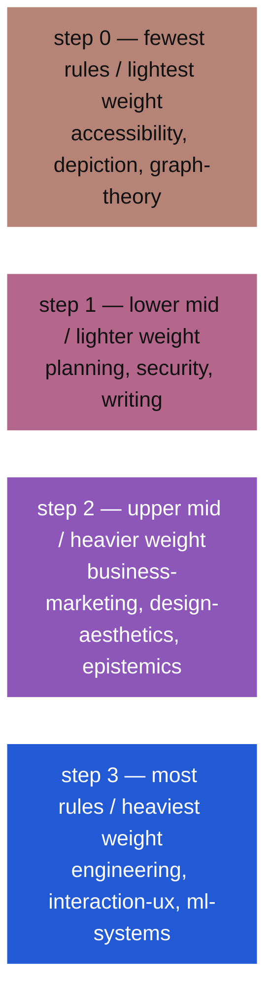

# Rule graph

Rules are nodes. A live `[[ID]]` cross-reference inside a rule row is
an undirected edge. The twelve files under `lexicons/` are a filing
projection over that graph: each rule lives in one file, but citations
cross file boundaries freely. This page shows the **lexicon quotient**:
one node per lexicon file, with each edge weighted by how many rule
citations run between that pair of files (see *Weighted edges*).

Generated from the rule corpus on each release; do not edit by hand.
Output is byte-stable: the same corpus produces the same bytes.

## Lexicon quotient

Twelve lexicon nodes, **53** weighted edges. The heaviest edge is **business-marketing** -- **engineering**, with **72** citations between them.

Each edge weight is a **circle** on the path between two lexicon
**rectangles** (mermaid has no circular edge-label form on GitHub).
Every edge also appears in the table below ([A11Y-02]). Lexicon fill is
a sequential rule-count step from the shared repo palette; weight-circle
fill, edge stroke colour, and stroke width encode the same weight (see
colour legend). All **53** weighted pairs are drawn — nothing is omitted.

```mermaid
%%{init: {'themeVariables': {'fontSize': '22px'}}}%%
graph LR
  accessibility["accessibility"]
  business_marketing["business-marketing"]
  depiction["depiction"]
  design_aesthetics["design-aesthetics"]
  engineering["engineering"]
  epistemics["epistemics"]
  graph_theory["graph-theory"]
  interaction_ux["interaction-ux"]
  ml_systems["ml-systems"]
  planning["planning"]
  security["security"]
  writing["writing"]
  business_marketing --- W_business_marketing__engineering((72))
  W_business_marketing__engineering --- engineering
  business_marketing --- W_business_marketing__interaction_ux((60))
  W_business_marketing__interaction_ux --- interaction_ux
  engineering --- W_engineering__ml_systems((54))
  W_engineering__ml_systems --- ml_systems
  engineering --- W_engineering__epistemics((52))
  W_engineering__epistemics --- epistemics
  business_marketing --- W_business_marketing__epistemics((49))
  W_business_marketing__epistemics --- epistemics
  engineering --- W_engineering__interaction_ux((49))
  W_engineering__interaction_ux --- interaction_ux
  engineering --- W_engineering__planning((48))
  W_engineering__planning --- planning
  interaction_ux --- W_interaction_ux__ml_systems((37))
  W_interaction_ux__ml_systems --- ml_systems
  business_marketing --- W_business_marketing__planning((34))
  W_business_marketing__planning --- planning
  design_aesthetics --- W_design_aesthetics__engineering((32))
  W_design_aesthetics__engineering --- engineering
  engineering --- W_engineering__security((32))
  W_engineering__security --- security
  epistemics --- W_epistemics__interaction_ux((27))
  W_epistemics__interaction_ux --- interaction_ux
  engineering --- W_engineering__graph_theory((25))
  W_engineering__graph_theory --- graph_theory
  ml_systems --- W_ml_systems__security((25))
  W_ml_systems__security --- security
  business_marketing --- W_business_marketing__ml_systems((23))
  W_business_marketing__ml_systems --- ml_systems
  epistemics --- W_epistemics__planning((23))
  W_epistemics__planning --- planning
  accessibility --- W_accessibility__interaction_ux((20))
  W_accessibility__interaction_ux --- interaction_ux
  graph_theory --- W_graph_theory__ml_systems((18))
  W_graph_theory__ml_systems --- ml_systems
  business_marketing --- W_business_marketing__security((15))
  W_business_marketing__security --- security
  epistemics --- W_epistemics__ml_systems((15))
  W_epistemics__ml_systems --- ml_systems
  accessibility --- W_accessibility__engineering((14))
  W_accessibility__engineering --- engineering
  business_marketing --- W_business_marketing__design_aesthetics((13))
  W_business_marketing__design_aesthetics --- design_aesthetics
  design_aesthetics --- W_design_aesthetics__interaction_ux((12))
  W_design_aesthetics__interaction_ux --- interaction_ux
  interaction_ux --- W_interaction_ux__security((12))
  W_interaction_ux__security --- security
  graph_theory --- W_graph_theory__interaction_ux((9))
  W_graph_theory__interaction_ux --- interaction_ux
  ml_systems --- W_ml_systems__writing((9))
  W_ml_systems__writing --- writing
  accessibility --- W_accessibility__business_marketing((8))
  W_accessibility__business_marketing --- business_marketing
  interaction_ux --- W_interaction_ux__planning((8))
  W_interaction_ux__planning --- planning
  business_marketing --- W_business_marketing__writing((7))
  W_business_marketing__writing --- writing
  depiction --- W_depiction__writing((7))
  W_depiction__writing --- writing
  interaction_ux --- W_interaction_ux__writing((7))
  W_interaction_ux__writing --- writing
  ml_systems --- W_ml_systems__planning((7))
  W_ml_systems__planning --- planning
  accessibility --- W_accessibility__design_aesthetics((6))
  W_accessibility__design_aesthetics --- design_aesthetics
  accessibility --- W_accessibility__ml_systems((6))
  W_accessibility__ml_systems --- ml_systems
  engineering --- W_engineering__writing((6))
  W_engineering__writing --- writing
  graph_theory --- W_graph_theory__security((5))
  W_graph_theory__security --- security
  planning --- W_planning__security((5))
  W_planning__security --- security
  accessibility --- W_accessibility__security((4))
  W_accessibility__security --- security
  depiction --- W_depiction__ml_systems((4))
  W_depiction__ml_systems --- ml_systems
  design_aesthetics --- W_design_aesthetics__planning((4))
  W_design_aesthetics__planning --- planning
  design_aesthetics --- W_design_aesthetics__writing((4))
  W_design_aesthetics__writing --- writing
  epistemics --- W_epistemics__writing((4))
  W_epistemics__writing --- writing
  accessibility --- W_accessibility__epistemics((3))
  W_accessibility__epistemics --- epistemics
  accessibility --- W_accessibility__depiction((2))
  W_accessibility__depiction --- depiction
  business_marketing --- W_business_marketing__depiction((2))
  W_business_marketing__depiction --- depiction
  business_marketing --- W_business_marketing__graph_theory((2))
  W_business_marketing__graph_theory --- graph_theory
  depiction --- W_depiction__epistemics((2))
  W_depiction__epistemics --- epistemics
  depiction --- W_depiction__interaction_ux((2))
  W_depiction__interaction_ux --- interaction_ux
  design_aesthetics --- W_design_aesthetics__ml_systems((2))
  W_design_aesthetics__ml_systems --- ml_systems
  graph_theory --- W_graph_theory__planning((2))
  W_graph_theory__planning --- planning
  security --- W_security__writing((2))
  W_security__writing --- writing
  epistemics --- W_epistemics__graph_theory((1))
  W_epistemics__graph_theory --- graph_theory
  epistemics --- W_epistemics__security((1))
  W_epistemics__security --- security
  classDef seq_0 fill:#B68477,color:#111111,stroke:#B68477
  classDef seq_1 fill:#B4668B,color:#111111,stroke:#B4668B
  classDef seq_2 fill:#8D57BA,color:#FFFFFF,stroke:#8D57BA
  classDef seq_3 fill:#225AD6,color:#FFFFFF,stroke:#225AD6
  class accessibility,depiction,graph_theory,W_design_aesthetics__interaction_ux,W_interaction_ux__security,W_graph_theory__interaction_ux,W_ml_systems__writing,W_accessibility__business_marketing,W_interaction_ux__planning,W_business_marketing__writing,W_depiction__writing,W_interaction_ux__writing,W_ml_systems__planning,W_accessibility__design_aesthetics,W_accessibility__ml_systems,W_engineering__writing,W_graph_theory__security,W_planning__security,W_accessibility__security,W_depiction__ml_systems,W_design_aesthetics__planning,W_design_aesthetics__writing,W_epistemics__writing,W_accessibility__epistemics,W_accessibility__depiction,W_business_marketing__depiction,W_business_marketing__graph_theory,W_depiction__epistemics,W_depiction__interaction_ux,W_design_aesthetics__ml_systems,W_graph_theory__planning,W_security__writing,W_epistemics__graph_theory,W_epistemics__security seq_0
  class planning,security,writing,W_business_marketing__planning,W_design_aesthetics__engineering,W_engineering__security,W_epistemics__interaction_ux,W_engineering__graph_theory,W_ml_systems__security,W_business_marketing__ml_systems,W_epistemics__planning,W_accessibility__interaction_ux,W_graph_theory__ml_systems,W_business_marketing__security,W_epistemics__ml_systems,W_accessibility__engineering,W_business_marketing__design_aesthetics seq_1
  class business_marketing,design_aesthetics,epistemics,W_business_marketing__interaction_ux,W_engineering__ml_systems,W_engineering__epistemics,W_business_marketing__epistemics,W_engineering__interaction_ux,W_engineering__planning,W_interaction_ux__ml_systems seq_2
  class engineering,interaction_ux,ml_systems,W_business_marketing__engineering seq_3
  linkStyle 0,1 stroke:#225AD6,stroke-width:4px
  linkStyle 2,3,4,5,6,7,8,9,10,11,12,13,14,15 stroke:#8D57BA,stroke-width:3px
  linkStyle 16,17,18,19,20,21,22,23,24,25,26,27,28,29,30,31,32,33,34,35,36,37,38,39,40,41,42,43 stroke:#B4668B,stroke-width:2px
  linkStyle 44,45,46,47,48,49,50,51,52,53,54,55,56,57,58,59,60,61,62,63,64,65,66,67,68,69,70,71,72,73,74,75,76,77,78,79,80,81,82,83,84,85,86,87,88,89,90,91,92,93,94,95,96,97,98,99,100,101,102,103,104,105 stroke:#B68477,stroke-width:1px
```

### Colour legend

Lexicon node fill, weight-circle fill, and edge stroke share one four-step **sequential** ramp: lightest = fewest rules / lighter edge weights, darkest = most rules / heavier weights. **Rectangles** are lexicon nodes; **circles** on a path are edge weights (citation counts). The swatches below are painted by the same `classDef` lines the diagram uses, so they are the colours, not a description of them.

```mermaid
%%{init: {'themeVariables': {'fontSize': '22px'}}}%%
flowchart LR
  SW0["step 0 — fewest rules / lightest weight<br/>accessibility, depiction, graph-theory"]
  SW1["step 1 — lower mid / lighter weight<br/>planning, security, writing"]
  SW2["step 2 — upper mid / heavier weight<br/>business-marketing, design-aesthetics, epistemics"]
  SW3["step 3 — most rules / heaviest weight<br/>engineering, interaction-ux, ml-systems"]
  classDef seq_0 fill:#B68477,color:#111111,stroke:#B68477
  classDef seq_1 fill:#B4668B,color:#111111,stroke:#B4668B
  classDef seq_2 fill:#8D57BA,color:#FFFFFF,stroke:#8D57BA
  classDef seq_3 fill:#225AD6,color:#FFFFFF,stroke:#225AD6
  class SW0 seq_0
  class SW1 seq_1
  class SW2 seq_2
  class SW3 seq_3
```

**Colour is never the only channel.** Every edge weight is also printed inside its circle and listed in the table below, and stroke width carries it a third time; every lexicon node's tier is recoverable from the rule counts in *Per-lexicon counts*. Delete the colour and the page loses no information ([A11Y-02]).

The ramp is derived, not picked: OKLab lightness starts at 0.66 and falls by 0.05 per step; chroma starts at 0.065 and rises by 0.045; hue starts at 35° and turns -44° per step (132° arc). Falling lightness is what makes the order survive greyscale and colour-vision deficiency — the hue rotation rides on top of a value scale rather than carrying the ordering itself.

### Weighted edges

**What the weight counts.** Every `[[ID]]` written inside a rule row is
one citation, and a citation points somewhere: the rule that contains it
names the rule it depends on. An edge weight here is simply **how many
of those citations run between the two files**, counted in both
directions and added together.

The heaviest edge, `business-marketing` -- `engineering` at **72**, therefore says: 72 separate `[[ID]]` citations sit in one of those two files and name a rule in the other.

"Directed" is doing one job in that sentence: if two rules cite *each
other*, that is **two** citations, not one. They arrived at each other
independently, from opposite sides, and the weight says so.

That is the whole reason two numbers on this page disagree. There are **892** cross-lexicon citations but only **853** cross-lexicon *edges*, because **39** pairs of rules cite each other — one edge, two citations. 853 + 39 = 892, exactly.

**How to read a heavy edge.** It is not a defect and not a merge
candidate. A heavy edge means two domains keep reaching for each other's
rules — the cross-domain convergence this corpus exists to surface. A
light edge means the two vocabularies are largely independent, which is
equally informative and much less common.

| lexicon A | lexicon B | citations between them |
|---|---|---:|
| [business-marketing](lexicons/business-marketing.md) | [engineering](lexicons/engineering.md) | 72 |
| [business-marketing](lexicons/business-marketing.md) | [interaction-ux](lexicons/interaction-ux.md) | 60 |
| [engineering](lexicons/engineering.md) | [ml-systems](lexicons/ml-systems.md) | 54 |
| [engineering](lexicons/engineering.md) | [epistemics](lexicons/epistemics.md) | 52 |
| [business-marketing](lexicons/business-marketing.md) | [epistemics](lexicons/epistemics.md) | 49 |
| [engineering](lexicons/engineering.md) | [interaction-ux](lexicons/interaction-ux.md) | 49 |
| [engineering](lexicons/engineering.md) | [planning](lexicons/planning.md) | 48 |
| [interaction-ux](lexicons/interaction-ux.md) | [ml-systems](lexicons/ml-systems.md) | 37 |
| [business-marketing](lexicons/business-marketing.md) | [planning](lexicons/planning.md) | 34 |
| [design-aesthetics](lexicons/design-aesthetics.md) | [engineering](lexicons/engineering.md) | 32 |
| [engineering](lexicons/engineering.md) | [security](lexicons/security.md) | 32 |
| [epistemics](lexicons/epistemics.md) | [interaction-ux](lexicons/interaction-ux.md) | 27 |
| [engineering](lexicons/engineering.md) | [graph-theory](lexicons/graph-theory.md) | 25 |
| [ml-systems](lexicons/ml-systems.md) | [security](lexicons/security.md) | 25 |
| [business-marketing](lexicons/business-marketing.md) | [ml-systems](lexicons/ml-systems.md) | 23 |
| [epistemics](lexicons/epistemics.md) | [planning](lexicons/planning.md) | 23 |
| [accessibility](lexicons/accessibility.md) | [interaction-ux](lexicons/interaction-ux.md) | 20 |
| [graph-theory](lexicons/graph-theory.md) | [ml-systems](lexicons/ml-systems.md) | 18 |
| [business-marketing](lexicons/business-marketing.md) | [security](lexicons/security.md) | 15 |
| [epistemics](lexicons/epistemics.md) | [ml-systems](lexicons/ml-systems.md) | 15 |
| [accessibility](lexicons/accessibility.md) | [engineering](lexicons/engineering.md) | 14 |
| [business-marketing](lexicons/business-marketing.md) | [design-aesthetics](lexicons/design-aesthetics.md) | 13 |
| [design-aesthetics](lexicons/design-aesthetics.md) | [interaction-ux](lexicons/interaction-ux.md) | 12 |
| [interaction-ux](lexicons/interaction-ux.md) | [security](lexicons/security.md) | 12 |
| [graph-theory](lexicons/graph-theory.md) | [interaction-ux](lexicons/interaction-ux.md) | 9 |
| [ml-systems](lexicons/ml-systems.md) | [writing](lexicons/writing.md) | 9 |
| [accessibility](lexicons/accessibility.md) | [business-marketing](lexicons/business-marketing.md) | 8 |
| [interaction-ux](lexicons/interaction-ux.md) | [planning](lexicons/planning.md) | 8 |
| [business-marketing](lexicons/business-marketing.md) | [writing](lexicons/writing.md) | 7 |
| [depiction](lexicons/depiction.md) | [writing](lexicons/writing.md) | 7 |
| [interaction-ux](lexicons/interaction-ux.md) | [writing](lexicons/writing.md) | 7 |
| [ml-systems](lexicons/ml-systems.md) | [planning](lexicons/planning.md) | 7 |
| [accessibility](lexicons/accessibility.md) | [design-aesthetics](lexicons/design-aesthetics.md) | 6 |
| [accessibility](lexicons/accessibility.md) | [ml-systems](lexicons/ml-systems.md) | 6 |
| [engineering](lexicons/engineering.md) | [writing](lexicons/writing.md) | 6 |
| [graph-theory](lexicons/graph-theory.md) | [security](lexicons/security.md) | 5 |
| [planning](lexicons/planning.md) | [security](lexicons/security.md) | 5 |
| [accessibility](lexicons/accessibility.md) | [security](lexicons/security.md) | 4 |
| [depiction](lexicons/depiction.md) | [ml-systems](lexicons/ml-systems.md) | 4 |
| [design-aesthetics](lexicons/design-aesthetics.md) | [planning](lexicons/planning.md) | 4 |
| [design-aesthetics](lexicons/design-aesthetics.md) | [writing](lexicons/writing.md) | 4 |
| [epistemics](lexicons/epistemics.md) | [writing](lexicons/writing.md) | 4 |
| [accessibility](lexicons/accessibility.md) | [epistemics](lexicons/epistemics.md) | 3 |
| [accessibility](lexicons/accessibility.md) | [depiction](lexicons/depiction.md) | 2 |
| [business-marketing](lexicons/business-marketing.md) | [depiction](lexicons/depiction.md) | 2 |
| [business-marketing](lexicons/business-marketing.md) | [graph-theory](lexicons/graph-theory.md) | 2 |
| [depiction](lexicons/depiction.md) | [epistemics](lexicons/epistemics.md) | 2 |
| [depiction](lexicons/depiction.md) | [interaction-ux](lexicons/interaction-ux.md) | 2 |
| [design-aesthetics](lexicons/design-aesthetics.md) | [ml-systems](lexicons/ml-systems.md) | 2 |
| [graph-theory](lexicons/graph-theory.md) | [planning](lexicons/planning.md) | 2 |
| [security](lexicons/security.md) | [writing](lexicons/writing.md) | 2 |
| [epistemics](lexicons/epistemics.md) | [graph-theory](lexicons/graph-theory.md) | 1 |
| [epistemics](lexicons/epistemics.md) | [security](lexicons/security.md) | 1 |

## Intra-lexicon vs cross-lexicon edges

Of **2372** simple undirected edges among rules, **1519** stay inside one lexicon file and **853** cross a file boundary (cut ratio **0.36** = cross / (intra + cross)).

**Reading A.** If the twelve lexicons were natural communities of the
citation graph, most edges would fall inside files.
A cut ratio of 0.36 is consistent with that claim.
This aggregate ratio alone does not establish a low-conductance
community partition; each file's boundary must be examined.

**Reading B (preferred).** This corpus exists to surface cross-domain
convergence. Independent arrivals at the same mechanism are its most
valuable output. Lexicons are a **retrieval** partition, driven by how
agents and people look up rules, not a community partition of the
citation graph. Cross-file links expose shared mechanisms across
domains, even when most edges stay within files. Re-partitioning the
files to minimise the cut would hide those convergences.

## Per-lexicon counts

One row per file. Read across:

- **rule nodes** — how many rules the file holds.
- **internal edges** — links from one of its rules to another of its
  own. High means the file is a self-contained body of practice.
- **external edges** — links between one of its rules and a rule in
  some other file. High means the file is a hub.
- **cut ratio** — external / (internal + external): the share of this
  file's links that leave it. **0.00** would be an island, **1.00** a
  file whose rules only ever connect outward and never to each other.

Both edge columns count undirected pairs, so a mutual citation is one
edge here (unlike the weights above). An edge between two files is
counted once in each file's external column, which is why the external
column sums to twice the cross-edge total rather than to it.

| lexicon | rule nodes | internal edges | external edges | cut ratio |
|---|---:|---:|---:|---:|
| [accessibility](lexicons/accessibility.md) | 64 | 31 | 60 | 0.66 |
| [business-marketing](lexicons/business-marketing.md) | 158 | 104 | 264 | 0.72 |
| [depiction](lexicons/depiction.md) | 17 | 12 | 19 | 0.61 |
| [design-aesthetics](lexicons/design-aesthetics.md) | 147 | 130 | 71 | 0.35 |
| [engineering](lexicons/engineering.md) | 440 | 393 | 358 | 0.48 |
| [epistemics](lexicons/epistemics.md) | 145 | 125 | 177 | 0.59 |
| [graph-theory](lexicons/graph-theory.md) | 71 | 65 | 62 | 0.49 |
| [interaction-ux](lexicons/interaction-ux.md) | 208 | 198 | 231 | 0.54 |
| [ml-systems](lexicons/ml-systems.md) | 263 | 221 | 199 | 0.47 |
| [planning](lexicons/planning.md) | 141 | 93 | 123 | 0.57 |
| [security](lexicons/security.md) | 120 | 101 | 96 | 0.49 |
| [writing](lexicons/writing.md) | 79 | 46 | 46 | 0.50 |

Underlying rule graph (not drawn here): **1853** rule nodes, **2372** distinct undirected edges (simple 2372 + self-loops 0).

