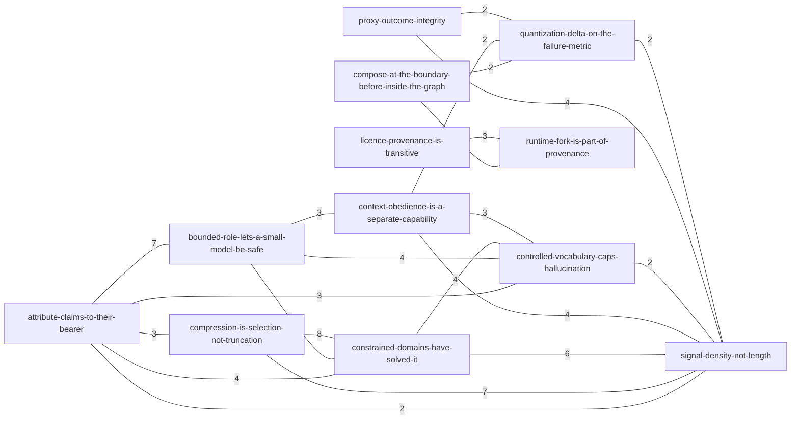

# Reasoning card map

> Generated by `python3 tools/cardmap.py` — do not edit by hand. **30 cards**, 18 principles referenced, 69 shared-rule pairs.

## What this is

Topology of the reasoning tree: which cards share rule IDs, and which principles each card owns or also-loads. Every node, edge, and table cell is derived from `public/reasoning/*.md` mechanism cards. Regenerate after any card edit.

## What this does not show

- Rule text, tiers, exemptions, or evidence rows (open the card and the lexicon).
- Principle force groups from PRINCIPLES.md.
- Pairs that share only one rule ID in the View B diagram (threshold is >= 2 shared IDs; the View B table lists all 69 pairs with at least one shared ID).
- Direction of dependence, ranking, or load order beyond own vs also-load.

## View A — principle map

Bipartite graph: card nodes and principle nodes. A **solid** link is the principle the card owns (`- N. Title` in its Principles section). A **dashed** link is an also-load mention (`Principle N` in that section's prose). Owned and also-load are not the same strength of claim.

```mermaid
flowchart LR
  P_1["1. Author the contract before the components"]
  P_2["2. Specify what would prove you wrong"]
  P_3["3. The safe side is cheap; the wrong side is not"]
  P_4["4. You get the number you pay for, not the outcome you want"]
  P_5["5. Rank the substance before you style it"]
  P_7["7. Write it where it outlives the person who knows it"]
  P_8["8. Assume a hostile landlord and keep a second exit"]
  P_9["9. A claim must walk back to what produced it"]
  P_10["10. Perceived boundaries must match enforced boundaries"]
  P_11["11. Unknown is a designed state"]
  P_12["12. Correction must reach the source"]
  P_13["13. Evidence precedes commitment"]
  P_14["14. Grant the least privilege; minimize what a compromise reaches"]
  P_15["15. A measurement the measured party can shape is not a measurement"]
  P_16["16. Fail loudly, succeed quietly"]
  P_17["17. High-impact actions take two independent keys"]
  P_18["18. A machine consumes contracts, not prose"]
  P_19["19. Step size is bounded by the feedback that can catch it"]
  C_attribute_claims_to_their_bearer["attribute-claims-to-their-bearer"]
  C_bounded_role_lets_a_small_model_be_safe["bounded-role-lets-a-small-model-be-safe"]
  C_compose_at_the_boundary_before_inside_the_graph["compose-at-the-boundary-before-inside-the-graph"]
  C_compression_is_selection_not_truncation["compression-is-selection-not-truncation"]
  C_constrained_domains_have_solved_it["constrained-domains-have-solved-it"]
  C_context_obedience_is_a_separate_capability["context-obedience-is-a-separate-capability"]
  C_contract_before_components["contract-before-components"]
  C_controlled_vocabulary_caps_hallucination["controlled-vocabulary-caps-hallucination"]
  C_correction_at_source["correction-at-source"]
  C_designed_unknown["designed-unknown"]
  C_dual_control_two_keys["dual-control-two-keys"]
  C_durable_decision_memory["durable-decision-memory"]
  C_evidence_before_commitment["evidence-before-commitment"]
  C_fail_loudly_succeed_quietly["fail-loudly-succeed-quietly"]
  C_falsification_disconfirmers["falsification-disconfirmers"]
  C_feedback_bounded_waiting["feedback-bounded-waiting"]
  C_frozen_base_additive_delta["frozen-base-additive-delta"]
  C_least_privilege_blast_radius["least-privilege-blast-radius"]
  C_licence_provenance_is_transitive["licence-provenance-is-transitive"]
  C_margin_and_design_effect_before_the_run["margin-and-design-effect-before-the-run"]
  C_measurement_integrity["measurement-integrity"]
  C_perceived_enforced_boundaries["perceived-enforced-boundaries"]
  C_proxy_outcome_integrity["proxy-outcome-integrity"]
  C_quantization_delta_on_the_failure_metric["quantization-delta-on-the-failure-metric"]
  C_reversible_commitments["reversible-commitments"]
  C_runtime_fork_is_part_of_provenance["runtime-fork-is-part-of-provenance"]
  C_second_exit_hostile_landlord["second-exit-hostile-landlord"]
  C_signal_density_not_length["signal-density-not-length"]
  C_step_size_by_feedback["step-size-by-feedback"]
  C_synthetic_artifact_control_arm["synthetic-artifact-control-arm"]
  C_attribute_claims_to_their_bearer --> P_9
  C_bounded_role_lets_a_small_model_be_safe --> P_11
  C_bounded_role_lets_a_small_model_be_safe --> P_18
  C_bounded_role_lets_a_small_model_be_safe --> P_9
  C_compose_at_the_boundary_before_inside_the_graph --> P_13
  C_compose_at_the_boundary_before_inside_the_graph --> P_3
  C_compression_is_selection_not_truncation --> P_5
  C_constrained_domains_have_solved_it --> P_18
  C_context_obedience_is_a_separate_capability --> P_13
  C_context_obedience_is_a_separate_capability --> P_18
  C_contract_before_components --> P_1
  C_contract_before_components --> P_18
  C_controlled_vocabulary_caps_hallucination --> P_11
  C_controlled_vocabulary_caps_hallucination --> P_18
  C_correction_at_source --> P_12
  C_correction_at_source -.-> P_9
  C_designed_unknown --> P_11
  C_designed_unknown -.-> P_13
  C_dual_control_two_keys --> P_17
  C_durable_decision_memory --> P_7
  C_durable_decision_memory -.-> P_9
  C_evidence_before_commitment --> P_13
  C_evidence_before_commitment -.-> P_2
  C_evidence_before_commitment -.-> P_9
  C_fail_loudly_succeed_quietly --> P_16
  C_falsification_disconfirmers --> P_2
  C_falsification_disconfirmers -.-> P_13
  C_feedback_bounded_waiting -.-> P_16
  C_feedback_bounded_waiting -.-> P_19
  C_frozen_base_additive_delta --> P_3
  C_least_privilege_blast_radius --> P_14
  C_licence_provenance_is_transitive --> P_13
  C_licence_provenance_is_transitive --> P_16
  C_margin_and_design_effect_before_the_run --> P_2
  C_measurement_integrity --> P_15
  C_perceived_enforced_boundaries --> P_10
  C_proxy_outcome_integrity --> P_4
  C_quantization_delta_on_the_failure_metric --> P_13
  C_quantization_delta_on_the_failure_metric --> P_4
  C_reversible_commitments --> P_3
  C_runtime_fork_is_part_of_provenance --> P_3
  C_runtime_fork_is_part_of_provenance --> P_8
  C_second_exit_hostile_landlord --> P_8
  C_signal_density_not_length --> P_15
  C_signal_density_not_length --> P_4
  C_step_size_by_feedback --> P_19
  C_step_size_by_feedback -.-> P_13
  C_step_size_by_feedback -.-> P_2
  C_synthetic_artifact_control_arm --> P_15
```

### Card–principle table

Text equivalent of View A (one row per card).

| Card | Owns | Also loads |
|---|---|---|
| [attribute-claims-to-their-bearer](attribute-claims-to-their-bearer.md) | 9. A claim must walk back to what produced it | (none) |
| [bounded-role-lets-a-small-model-be-safe](bounded-role-lets-a-small-model-be-safe.md) | 9. A claim must walk back to what produced it; 11. Unknown is a designed state; 18. A machine consumes contracts, not prose | (none) |
| [compose-at-the-boundary-before-inside-the-graph](compose-at-the-boundary-before-inside-the-graph.md) | 3. The safe side is cheap; the wrong side is not; 13. Evidence precedes commitment | (none) |
| [compression-is-selection-not-truncation](compression-is-selection-not-truncation.md) | 5. Rank the substance before you style it | (none) |
| [constrained-domains-have-solved-it](constrained-domains-have-solved-it.md) | 18. A machine consumes contracts, not prose | (none) |
| [context-obedience-is-a-separate-capability](context-obedience-is-a-separate-capability.md) | 13. Evidence precedes commitment; 18. A machine consumes contracts, not prose | (none) |
| [contract-before-components](contract-before-components.md) | 1. Author the contract before the components; 18. A machine consumes contracts, not prose | (none) |
| [controlled-vocabulary-caps-hallucination](controlled-vocabulary-caps-hallucination.md) | 11. Unknown is a designed state; 18. A machine consumes contracts, not prose | (none) |
| [correction-at-source](correction-at-source.md) | 12. Correction must reach the source | 9. A claim must walk back to what produced it |
| [designed-unknown](designed-unknown.md) | 11. Unknown is a designed state | 13. Evidence precedes commitment |
| [dual-control-two-keys](dual-control-two-keys.md) | 17. High-impact actions take two independent keys | (none) |
| [durable-decision-memory](durable-decision-memory.md) | 7. Write it where it outlives the person who knows it | 9. A claim must walk back to what produced it |
| [evidence-before-commitment](evidence-before-commitment.md) | 13. Evidence precedes commitment | 2. Specify what would prove you wrong; 9. A claim must walk back to what produced it |
| [fail-loudly-succeed-quietly](fail-loudly-succeed-quietly.md) | 16. Fail loudly, succeed quietly | (none) |
| [falsification-disconfirmers](falsification-disconfirmers.md) | 2. Specify what would prove you wrong | 13. Evidence precedes commitment |
| [feedback-bounded-waiting](feedback-bounded-waiting.md) | (none) | 16. Fail loudly, succeed quietly; 19. Step size is bounded by the feedback that can catch it |
| [frozen-base-additive-delta](frozen-base-additive-delta.md) | 3. The safe side is cheap; the wrong side is not | (none) |
| [least-privilege-blast-radius](least-privilege-blast-radius.md) | 14. Grant the least privilege; minimize what a compromise reaches | (none) |
| [licence-provenance-is-transitive](licence-provenance-is-transitive.md) | 13. Evidence precedes commitment; 16. Fail loudly, succeed quietly | (none) |
| [margin-and-design-effect-before-the-run](margin-and-design-effect-before-the-run.md) | 2. Specify what would prove you wrong | (none) |
| [measurement-integrity](measurement-integrity.md) | 15. A measurement the measured party can shape is not a measurement | (none) |
| [perceived-enforced-boundaries](perceived-enforced-boundaries.md) | 10. Perceived boundaries must match enforced boundaries | (none) |
| [proxy-outcome-integrity](proxy-outcome-integrity.md) | 4. You get the number you pay for, not the outcome you want | (none) |
| [quantization-delta-on-the-failure-metric](quantization-delta-on-the-failure-metric.md) | 4. You get the number you pay for, not the outcome you want; 13. Evidence precedes commitment | (none) |
| [reversible-commitments](reversible-commitments.md) | 3. The safe side is cheap; the wrong side is not | (none) |
| [runtime-fork-is-part-of-provenance](runtime-fork-is-part-of-provenance.md) | 3. The safe side is cheap; the wrong side is not; 8. Assume a hostile landlord and keep a second exit | (none) |
| [second-exit-hostile-landlord](second-exit-hostile-landlord.md) | 8. Assume a hostile landlord and keep a second exit | (none) |
| [signal-density-not-length](signal-density-not-length.md) | 4. You get the number you pay for, not the outcome you want; 15. A measurement the measured party can shape is not a measurement | (none) |
| [step-size-by-feedback](step-size-by-feedback.md) | 19. Step size is bounded by the feedback that can catch it | 2. Specify what would prove you wrong; 13. Evidence precedes commitment |
| [synthetic-artifact-control-arm](synthetic-artifact-control-arm.md) | 15. A measurement the measured party can shape is not a measurement | (none) |

## View B — card adjacency by shared rule IDs

The diagram draws only pairs that share **>= 2** rule IDs (22 edges). Edge labels are the shared count. The table below is the full relation: **all 69** pairs that share at least one rule ID, with the shared IDs linked as on the cards.

### Shared rule ID pairs

Superset of the diagram. Sorted by Card A, then Card B (slug order).

| Card A | Card B | Shared count | Shared rule IDs |
|---|---|---:|---|
| [attribute-claims-to-their-bearer](attribute-claims-to-their-bearer.md) | [bounded-role-lets-a-small-model-be-safe](bounded-role-lets-a-small-model-be-safe.md) | 7 | [ATTRIB-01](../lexicons/depiction.md#attrib-01), [ATTRIB-02](../lexicons/depiction.md#attrib-02), [ATTRIB-03](../lexicons/depiction.md#attrib-03), [BOUND-01](../lexicons/depiction.md#bound-01), [HAI-01](../lexicons/interaction-ux.md#hai-01), [PROV-01](../lexicons/ml-systems.md#prov-01), [WRIT-26](../lexicons/writing.md#writ-26) |
| [attribute-claims-to-their-bearer](attribute-claims-to-their-bearer.md) | [compression-is-selection-not-truncation](compression-is-selection-not-truncation.md) | 3 | [A11Y-02](../lexicons/accessibility.md#a11y-02), [BOUND-05](../lexicons/depiction.md#bound-05), [WRIT-03](../lexicons/writing.md#writ-03) |
| [attribute-claims-to-their-bearer](attribute-claims-to-their-bearer.md) | [constrained-domains-have-solved-it](constrained-domains-have-solved-it.md) | 4 | [A11Y-02](../lexicons/accessibility.md#a11y-02), [BOUND-01](../lexicons/depiction.md#bound-01), [BOUND-05](../lexicons/depiction.md#bound-05), [WRIT-03](../lexicons/writing.md#writ-03) |
| [attribute-claims-to-their-bearer](attribute-claims-to-their-bearer.md) | [context-obedience-is-a-separate-capability](context-obedience-is-a-separate-capability.md) | 1 | [PROV-01](../lexicons/ml-systems.md#prov-01) |
| [attribute-claims-to-their-bearer](attribute-claims-to-their-bearer.md) | [controlled-vocabulary-caps-hallucination](controlled-vocabulary-caps-hallucination.md) | 3 | [BOUND-01](../lexicons/depiction.md#bound-01), [PROV-01](../lexicons/ml-systems.md#prov-01), [WRIT-03](../lexicons/writing.md#writ-03) |
| [attribute-claims-to-their-bearer](attribute-claims-to-their-bearer.md) | [licence-provenance-is-transitive](licence-provenance-is-transitive.md) | 1 | [PROV-01](../lexicons/ml-systems.md#prov-01) |
| [attribute-claims-to-their-bearer](attribute-claims-to-their-bearer.md) | [quantization-delta-on-the-failure-metric](quantization-delta-on-the-failure-metric.md) | 1 | [BIAS-02](../lexicons/epistemics.md#bias-02) |
| [attribute-claims-to-their-bearer](attribute-claims-to-their-bearer.md) | [runtime-fork-is-part-of-provenance](runtime-fork-is-part-of-provenance.md) | 1 | [PROV-01](../lexicons/ml-systems.md#prov-01) |
| [attribute-claims-to-their-bearer](attribute-claims-to-their-bearer.md) | [signal-density-not-length](signal-density-not-length.md) | 2 | [A11Y-02](../lexicons/accessibility.md#a11y-02), [PROV-01](../lexicons/ml-systems.md#prov-01) |
| [bounded-role-lets-a-small-model-be-safe](bounded-role-lets-a-small-model-be-safe.md) | [constrained-domains-have-solved-it](constrained-domains-have-solved-it.md) | 2 | [BOUND-01](../lexicons/depiction.md#bound-01), [FM-04](../lexicons/ml-systems.md#fm-04) |
| [bounded-role-lets-a-small-model-be-safe](bounded-role-lets-a-small-model-be-safe.md) | [context-obedience-is-a-separate-capability](context-obedience-is-a-separate-capability.md) | 3 | [FM-01](../lexicons/ml-systems.md#fm-01), [FM-04](../lexicons/ml-systems.md#fm-04), [PROV-01](../lexicons/ml-systems.md#prov-01) |
| [bounded-role-lets-a-small-model-be-safe](bounded-role-lets-a-small-model-be-safe.md) | [contract-before-components](contract-before-components.md) | 1 | [FM-04](../lexicons/ml-systems.md#fm-04) |
| [bounded-role-lets-a-small-model-be-safe](bounded-role-lets-a-small-model-be-safe.md) | [controlled-vocabulary-caps-hallucination](controlled-vocabulary-caps-hallucination.md) | 4 | [BOUND-01](../lexicons/depiction.md#bound-01), [CAL-02](../lexicons/ml-systems.md#cal-02), [FM-04](../lexicons/ml-systems.md#fm-04), [PROV-01](../lexicons/ml-systems.md#prov-01) |
| [bounded-role-lets-a-small-model-be-safe](bounded-role-lets-a-small-model-be-safe.md) | [designed-unknown](designed-unknown.md) | 1 | [CAL-02](../lexicons/ml-systems.md#cal-02) |
| [bounded-role-lets-a-small-model-be-safe](bounded-role-lets-a-small-model-be-safe.md) | [frozen-base-additive-delta](frozen-base-additive-delta.md) | 1 | [FM-05](../lexicons/ml-systems.md#fm-05) |
| [bounded-role-lets-a-small-model-be-safe](bounded-role-lets-a-small-model-be-safe.md) | [licence-provenance-is-transitive](licence-provenance-is-transitive.md) | 1 | [PROV-01](../lexicons/ml-systems.md#prov-01) |
| [bounded-role-lets-a-small-model-be-safe](bounded-role-lets-a-small-model-be-safe.md) | [quantization-delta-on-the-failure-metric](quantization-delta-on-the-failure-metric.md) | 1 | [COST-07](../lexicons/ml-systems.md#cost-07) |
| [bounded-role-lets-a-small-model-be-safe](bounded-role-lets-a-small-model-be-safe.md) | [runtime-fork-is-part-of-provenance](runtime-fork-is-part-of-provenance.md) | 1 | [PROV-01](../lexicons/ml-systems.md#prov-01) |
| [bounded-role-lets-a-small-model-be-safe](bounded-role-lets-a-small-model-be-safe.md) | [signal-density-not-length](signal-density-not-length.md) | 1 | [PROV-01](../lexicons/ml-systems.md#prov-01) |
| [compose-at-the-boundary-before-inside-the-graph](compose-at-the-boundary-before-inside-the-graph.md) | [constrained-domains-have-solved-it](constrained-domains-have-solved-it.md) | 1 | [ARCH-08](../lexicons/engineering.md#arch-08) |
| [compose-at-the-boundary-before-inside-the-graph](compose-at-the-boundary-before-inside-the-graph.md) | [evidence-before-commitment](evidence-before-commitment.md) | 1 | [TEST-03](../lexicons/engineering.md#test-03) |
| [compose-at-the-boundary-before-inside-the-graph](compose-at-the-boundary-before-inside-the-graph.md) | [frozen-base-additive-delta](frozen-base-additive-delta.md) | 1 | [FM-09](../lexicons/ml-systems.md#fm-09) |
| [compose-at-the-boundary-before-inside-the-graph](compose-at-the-boundary-before-inside-the-graph.md) | [quantization-delta-on-the-failure-metric](quantization-delta-on-the-failure-metric.md) | 2 | [EVAL-08](../lexicons/ml-systems.md#eval-08), [SERVE-07](../lexicons/ml-systems.md#serve-07) |
| [compose-at-the-boundary-before-inside-the-graph](compose-at-the-boundary-before-inside-the-graph.md) | [reversible-commitments](reversible-commitments.md) | 1 | [RLSE-08](../lexicons/engineering.md#rlse-08) |
| [compose-at-the-boundary-before-inside-the-graph](compose-at-the-boundary-before-inside-the-graph.md) | [runtime-fork-is-part-of-provenance](runtime-fork-is-part-of-provenance.md) | 6 | [ARCH-08](../lexicons/engineering.md#arch-08), [RLSE-08](../lexicons/engineering.md#rlse-08), [RLSE-10](../lexicons/engineering.md#rlse-10), [SERVE-01](../lexicons/ml-systems.md#serve-01), [SERVE-03](../lexicons/ml-systems.md#serve-03), [SERVE-07](../lexicons/ml-systems.md#serve-07) |
| [compression-is-selection-not-truncation](compression-is-selection-not-truncation.md) | [constrained-domains-have-solved-it](constrained-domains-have-solved-it.md) | 8 | [A11Y-02](../lexicons/accessibility.md#a11y-02), [A11Y-39](../lexicons/accessibility.md#a11y-39), [A11Y-40](../lexicons/accessibility.md#a11y-40), [A11Y-41](../lexicons/accessibility.md#a11y-41), [A11Y-43](../lexicons/accessibility.md#a11y-43), [A11Y-44](../lexicons/accessibility.md#a11y-44), [BOUND-05](../lexicons/depiction.md#bound-05), [WRIT-03](../lexicons/writing.md#writ-03) |
| [compression-is-selection-not-truncation](compression-is-selection-not-truncation.md) | [controlled-vocabulary-caps-hallucination](controlled-vocabulary-caps-hallucination.md) | 1 | [WRIT-03](../lexicons/writing.md#writ-03) |
| [compression-is-selection-not-truncation](compression-is-selection-not-truncation.md) | [signal-density-not-length](signal-density-not-length.md) | 7 | [A11Y-02](../lexicons/accessibility.md#a11y-02), [A11Y-39](../lexicons/accessibility.md#a11y-39), [A11Y-40](../lexicons/accessibility.md#a11y-40), [A11Y-43](../lexicons/accessibility.md#a11y-43), [A11Y-44](../lexicons/accessibility.md#a11y-44), [WRIT-05](../lexicons/writing.md#writ-05), [WRIT-17](../lexicons/writing.md#writ-17) |
| [constrained-domains-have-solved-it](constrained-domains-have-solved-it.md) | [context-obedience-is-a-separate-capability](context-obedience-is-a-separate-capability.md) | 1 | [FM-04](../lexicons/ml-systems.md#fm-04) |
| [constrained-domains-have-solved-it](constrained-domains-have-solved-it.md) | [contract-before-components](contract-before-components.md) | 1 | [FM-04](../lexicons/ml-systems.md#fm-04) |
| [constrained-domains-have-solved-it](constrained-domains-have-solved-it.md) | [controlled-vocabulary-caps-hallucination](controlled-vocabulary-caps-hallucination.md) | 4 | [BOUND-01](../lexicons/depiction.md#bound-01), [FM-04](../lexicons/ml-systems.md#fm-04), [WRIT-03](../lexicons/writing.md#writ-03), [WRIT-06](../lexicons/writing.md#writ-06) |
| [constrained-domains-have-solved-it](constrained-domains-have-solved-it.md) | [evidence-before-commitment](evidence-before-commitment.md) | 1 | [AIPX-01](../lexicons/business-marketing.md#aipx-01) |
| [constrained-domains-have-solved-it](constrained-domains-have-solved-it.md) | [runtime-fork-is-part-of-provenance](runtime-fork-is-part-of-provenance.md) | 1 | [ARCH-08](../lexicons/engineering.md#arch-08) |
| [constrained-domains-have-solved-it](constrained-domains-have-solved-it.md) | [signal-density-not-length](signal-density-not-length.md) | 6 | [A11Y-02](../lexicons/accessibility.md#a11y-02), [A11Y-09](../lexicons/accessibility.md#a11y-09), [A11Y-39](../lexicons/accessibility.md#a11y-39), [A11Y-40](../lexicons/accessibility.md#a11y-40), [A11Y-43](../lexicons/accessibility.md#a11y-43), [A11Y-44](../lexicons/accessibility.md#a11y-44) |
| [context-obedience-is-a-separate-capability](context-obedience-is-a-separate-capability.md) | [contract-before-components](contract-before-components.md) | 1 | [FM-04](../lexicons/ml-systems.md#fm-04) |
| [context-obedience-is-a-separate-capability](context-obedience-is-a-separate-capability.md) | [controlled-vocabulary-caps-hallucination](controlled-vocabulary-caps-hallucination.md) | 3 | [EVAL-11](../lexicons/ml-systems.md#eval-11), [FM-04](../lexicons/ml-systems.md#fm-04), [PROV-01](../lexicons/ml-systems.md#prov-01) |
| [context-obedience-is-a-separate-capability](context-obedience-is-a-separate-capability.md) | [evidence-before-commitment](evidence-before-commitment.md) | 1 | [EVAL-01](../lexicons/ml-systems.md#eval-01) |
| [context-obedience-is-a-separate-capability](context-obedience-is-a-separate-capability.md) | [licence-provenance-is-transitive](licence-provenance-is-transitive.md) | 1 | [PROV-01](../lexicons/ml-systems.md#prov-01) |
| [context-obedience-is-a-separate-capability](context-obedience-is-a-separate-capability.md) | [proxy-outcome-integrity](proxy-outcome-integrity.md) | 1 | [EVAL-22](../lexicons/ml-systems.md#eval-22) |
| [context-obedience-is-a-separate-capability](context-obedience-is-a-separate-capability.md) | [quantization-delta-on-the-failure-metric](quantization-delta-on-the-failure-metric.md) | 2 | [EVAL-01](../lexicons/ml-systems.md#eval-01), [EVAL-22](../lexicons/ml-systems.md#eval-22) |
| [context-obedience-is-a-separate-capability](context-obedience-is-a-separate-capability.md) | [runtime-fork-is-part-of-provenance](runtime-fork-is-part-of-provenance.md) | 1 | [PROV-01](../lexicons/ml-systems.md#prov-01) |
| [context-obedience-is-a-separate-capability](context-obedience-is-a-separate-capability.md) | [signal-density-not-length](signal-density-not-length.md) | 4 | [EVAL-11](../lexicons/ml-systems.md#eval-11), [EVAL-22](../lexicons/ml-systems.md#eval-22), [PROV-01](../lexicons/ml-systems.md#prov-01), [RAG-07](../lexicons/ml-systems.md#rag-07) |
| [context-obedience-is-a-separate-capability](context-obedience-is-a-separate-capability.md) | [synthetic-artifact-control-arm](synthetic-artifact-control-arm.md) | 1 | [EVAL-06](../lexicons/ml-systems.md#eval-06) |
| [contract-before-components](contract-before-components.md) | [controlled-vocabulary-caps-hallucination](controlled-vocabulary-caps-hallucination.md) | 1 | [FM-04](../lexicons/ml-systems.md#fm-04) |
| [contract-before-components](contract-before-components.md) | [evidence-before-commitment](evidence-before-commitment.md) | 1 | [AGT-04](../lexicons/engineering.md#agt-04) |
| [contract-before-components](contract-before-components.md) | [falsification-disconfirmers](falsification-disconfirmers.md) | 1 | [CLM-05](../lexicons/business-marketing.md#clm-05) |
| [contract-before-components](contract-before-components.md) | [licence-provenance-is-transitive](licence-provenance-is-transitive.md) | 1 | [RLSE-02](../lexicons/engineering.md#rlse-02) |
| [controlled-vocabulary-caps-hallucination](controlled-vocabulary-caps-hallucination.md) | [correction-at-source](correction-at-source.md) | 1 | [WRIT-44](../lexicons/writing.md#writ-44) |
| [controlled-vocabulary-caps-hallucination](controlled-vocabulary-caps-hallucination.md) | [designed-unknown](designed-unknown.md) | 1 | [CAL-02](../lexicons/ml-systems.md#cal-02) |
| [controlled-vocabulary-caps-hallucination](controlled-vocabulary-caps-hallucination.md) | [licence-provenance-is-transitive](licence-provenance-is-transitive.md) | 1 | [PROV-01](../lexicons/ml-systems.md#prov-01) |
| [controlled-vocabulary-caps-hallucination](controlled-vocabulary-caps-hallucination.md) | [runtime-fork-is-part-of-provenance](runtime-fork-is-part-of-provenance.md) | 1 | [PROV-01](../lexicons/ml-systems.md#prov-01) |
| [controlled-vocabulary-caps-hallucination](controlled-vocabulary-caps-hallucination.md) | [signal-density-not-length](signal-density-not-length.md) | 2 | [EVAL-11](../lexicons/ml-systems.md#eval-11), [PROV-01](../lexicons/ml-systems.md#prov-01) |
| [designed-unknown](designed-unknown.md) | [dual-control-two-keys](dual-control-two-keys.md) | 1 | [HITL-07](../lexicons/ml-systems.md#hitl-07) |
| [evidence-before-commitment](evidence-before-commitment.md) | [quantization-delta-on-the-failure-metric](quantization-delta-on-the-failure-metric.md) | 1 | [EVAL-01](../lexicons/ml-systems.md#eval-01) |
| [fail-loudly-succeed-quietly](fail-loudly-succeed-quietly.md) | [licence-provenance-is-transitive](licence-provenance-is-transitive.md) | 1 | [RLSE-05](../lexicons/engineering.md#rlse-05) |
| [falsification-disconfirmers](falsification-disconfirmers.md) | [measurement-integrity](measurement-integrity.md) | 1 | [TEST-06](../lexicons/engineering.md#test-06) |
| [licence-provenance-is-transitive](licence-provenance-is-transitive.md) | [runtime-fork-is-part-of-provenance](runtime-fork-is-part-of-provenance.md) | 3 | [PROV-01](../lexicons/ml-systems.md#prov-01), [PROV-07](../lexicons/ml-systems.md#prov-07), [PROV-08](../lexicons/ml-systems.md#prov-08) |
| [licence-provenance-is-transitive](licence-provenance-is-transitive.md) | [signal-density-not-length](signal-density-not-length.md) | 1 | [PROV-01](../lexicons/ml-systems.md#prov-01) |
| [margin-and-design-effect-before-the-run](margin-and-design-effect-before-the-run.md) | [quantization-delta-on-the-failure-metric](quantization-delta-on-the-failure-metric.md) | 1 | [EXP-12](../lexicons/epistemics.md#exp-12) |
| [measurement-integrity](measurement-integrity.md) | [signal-density-not-length](signal-density-not-length.md) | 1 | [EVAL-19](../lexicons/ml-systems.md#eval-19) |
| [measurement-integrity](measurement-integrity.md) | [synthetic-artifact-control-arm](synthetic-artifact-control-arm.md) | 1 | [MLDATA-09](../lexicons/ml-systems.md#mldata-09) |
| [perceived-enforced-boundaries](perceived-enforced-boundaries.md) | [second-exit-hostile-landlord](second-exit-hostile-landlord.md) | 1 | [SEC-01](../lexicons/security.md#sec-01) |
| [proxy-outcome-integrity](proxy-outcome-integrity.md) | [quantization-delta-on-the-failure-metric](quantization-delta-on-the-failure-metric.md) | 2 | [EVAL-22](../lexicons/ml-systems.md#eval-22), [RSCH-07](../lexicons/epistemics.md#rsch-07) |
| [proxy-outcome-integrity](proxy-outcome-integrity.md) | [signal-density-not-length](signal-density-not-length.md) | 4 | [AIPX-02](../lexicons/business-marketing.md#aipx-02), [EVAL-22](../lexicons/ml-systems.md#eval-22), [RSCH-07](../lexicons/epistemics.md#rsch-07), [UXR-03](../lexicons/interaction-ux.md#uxr-03) |
| [quantization-delta-on-the-failure-metric](quantization-delta-on-the-failure-metric.md) | [runtime-fork-is-part-of-provenance](runtime-fork-is-part-of-provenance.md) | 1 | [SERVE-07](../lexicons/ml-systems.md#serve-07) |
| [quantization-delta-on-the-failure-metric](quantization-delta-on-the-failure-metric.md) | [signal-density-not-length](signal-density-not-length.md) | 2 | [EVAL-22](../lexicons/ml-systems.md#eval-22), [RSCH-07](../lexicons/epistemics.md#rsch-07) |
| [reversible-commitments](reversible-commitments.md) | [runtime-fork-is-part-of-provenance](runtime-fork-is-part-of-provenance.md) | 1 | [RLSE-08](../lexicons/engineering.md#rlse-08) |
| [runtime-fork-is-part-of-provenance](runtime-fork-is-part-of-provenance.md) | [second-exit-hostile-landlord](second-exit-hostile-landlord.md) | 1 | [REF-15](../lexicons/engineering.md#ref-15) |
| [runtime-fork-is-part-of-provenance](runtime-fork-is-part-of-provenance.md) | [signal-density-not-length](signal-density-not-length.md) | 1 | [PROV-01](../lexicons/ml-systems.md#prov-01) |
