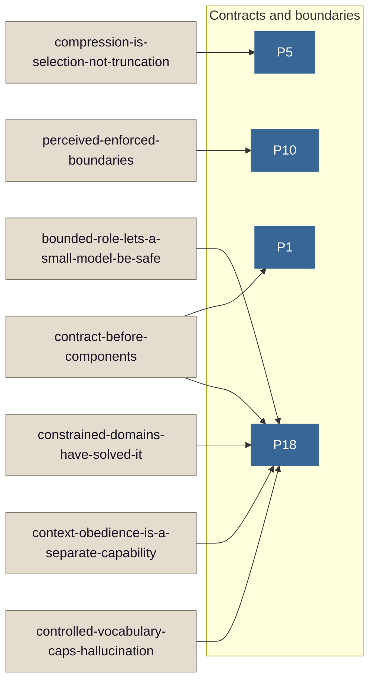
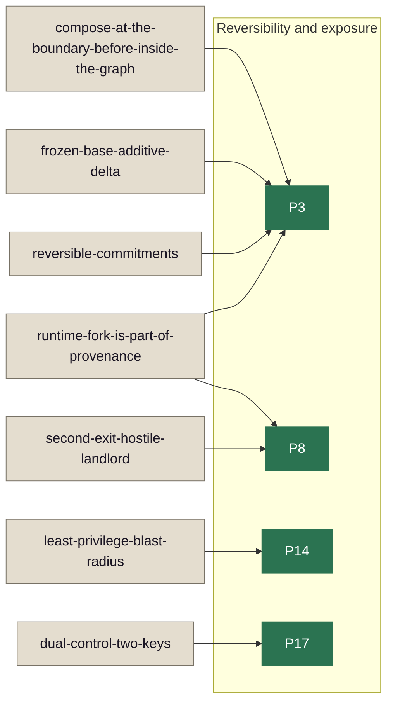
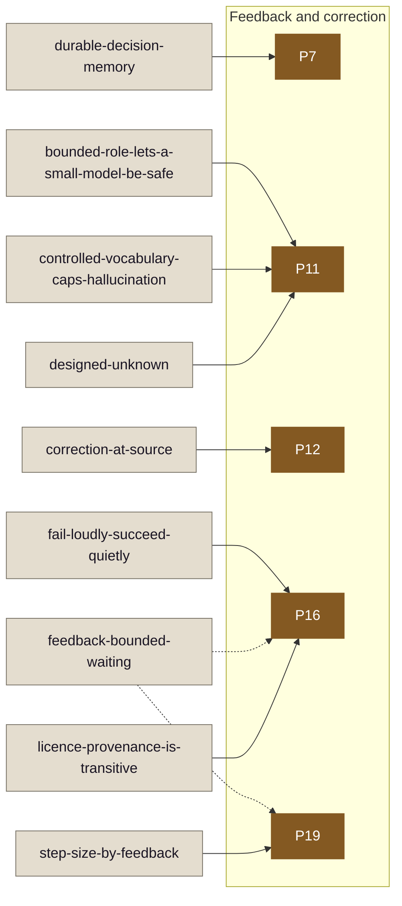
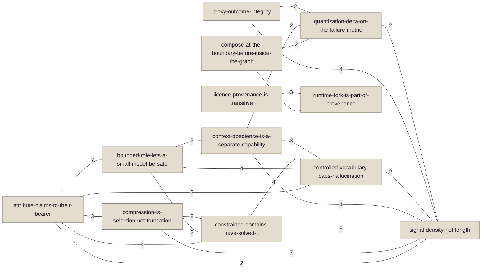

# Reasoning card map

> Generated from the reasoning tree on each release — do not edit by hand. **30 cards**, 18 principles referenced, 69 shared-rule pairs, 36/36 routes reach at least one card.

## What this is

Topology of the reasoning tree: which cards share rule IDs, which principles each card owns or also-loads, and which cards a changed-artifact route can open. Every node, edge, and table cell is derived from `public/reasoning/*.md` mechanism cards and the live `ROUTES` table. Regenerate after any card or route edit.

## What this does not show

- Rule text, tiers, exemptions, or evidence rows (open the card and the lexicon).
- Pairs that share only one rule ID in the View B diagram (threshold is >= 2 shared IDs; the View B table lists all 69 pairs with at least one shared ID).
- Views A and B: direction of dependence, ranking, or load order beyond own vs also-load. (Cards by route is ranked; see that section.)
- Phase-filtered select results (the route view uses every live rule in the route's families; `select --route <r> --with-cards` can narrow).

## View A — principle map

One section per force group — the `##` headings in PRINCIPLES.md that contain numbered `### N. Title` principles (document order). A force with at least one reached principle gets a small-multiple diagram of those principles as nodes labelled `P{n}` (the leading `P` marks a principle and is not a rule ID — rules are always `FAM-NN`) and only the cards that own or also-load them; a fully unreached force has heading, legend, and note — no diagram. Members no card reaches appear in the legend with a trailing marker instead of as diagram nodes. A **solid** link is the principle the card owns (`- N. Title` in its Principles section). A **dashed** link is an also-load mention (`Principle N` in that section's prose). Owned and also-load are not the same strength of claim.

A card that links to principles in more than one force appears in each of those diagrams. That is intended — not a duplicate-node bug. Working principle links live in the per-force legend lines and in the card–principle table below (mermaid `click` targets are inert on GitHub under `securityLevel: 'strict'` and exist only for loose renderers such as mermaid.live or VS Code preview). The graph is for adjacency; the legend and table carry the titles and the links that resolve.

A trailing `— no card` on a legend entry means that force member appears in PRINCIPLES.md but no mechanism card owns or also-loads it.

### Contracts and boundaries

**Principles in this force:** [P1](../PRINCIPLES.md#1-author-the-contract-before-the-components) (Author the contract before the components); [P5](../PRINCIPLES.md#5-rank-the-substance-before-you-style-it) (Rank the substance before you style it); [P6](../PRINCIPLES.md#6-an-unchosen-default-is-a-defect-the-user-feels-before-they-can-name-it) (An unchosen default is a defect the user feels before they can name it) — no card; [P10](../PRINCIPLES.md#10-perceived-boundaries-must-match-enforced-boundaries) (Perceived boundaries must match enforced boundaries); [P18](../PRINCIPLES.md#18-a-machine-consumes-contracts-not-prose) (A machine consumes contracts, not prose).

### Evidence and measurement

**Principles in this force:** [P2](../PRINCIPLES.md#2-specify-what-would-prove-you-wrong) (Specify what would prove you wrong); [P4](../PRINCIPLES.md#4-you-get-the-number-you-pay-for-not-the-outcome-you-want) (You get the number you pay for, not the outcome you want); [P9](../PRINCIPLES.md#9-a-claim-must-walk-back-to-what-produced-it) (A claim must walk back to what produced it); [P13](../PRINCIPLES.md#13-evidence-precedes-commitment) (Evidence precedes commitment); [P15](../PRINCIPLES.md#15-a-measurement-the-measured-party-can-shape-is-not-a-measurement) (A measurement the measured party can shape is not a measurement).

```mermaid
%%{init: {'themeVariables': {'fontSize': '18px'}}}%%
flowchart LR
  subgraph FG_evidence["Evidence and measurement"]
    P_2["P2"]
    P_4["P4"]
    P_9["P9"]
    P_13["P13"]
    P_15["P15"]
  end
  C_attribute_claims_to_their_bearer["attribute-claims-to-their-bearer"] --> P_9
  C_bounded_role_lets_a_small_model_be_safe["bounded-role-lets-a-small-model-be-safe"] --> P_9
  C_compose_at_the_boundary_before_inside_the_graph["compose-at-the-boundary-before-inside-the-graph"] --> P_13
  C_context_obedience_is_a_separate_capability["context-obedience-is-a-separate-capability"] --> P_13
  C_correction_at_source["correction-at-source"] -.-> P_9
  C_designed_unknown["designed-unknown"] -.-> P_13
  C_durable_decision_memory["durable-decision-memory"] -.-> P_9
  C_evidence_before_commitment["evidence-before-commitment"] --> P_13
  C_evidence_before_commitment -.-> P_2
  C_evidence_before_commitment -.-> P_9
  C_falsification_disconfirmers["falsification-disconfirmers"] --> P_2
  C_falsification_disconfirmers -.-> P_13
  C_licence_provenance_is_transitive["licence-provenance-is-transitive"] --> P_13
  C_margin_and_design_effect_before_the_run["margin-and-design-effect-before-the-run"] --> P_2
  C_measurement_integrity["measurement-integrity"] --> P_15
  C_proxy_outcome_integrity["proxy-outcome-integrity"] --> P_4
  C_quantization_delta_on_the_failure_metric["quantization-delta-on-the-failure-metric"] --> P_4
  C_quantization_delta_on_the_failure_metric --> P_13
  C_signal_density_not_length["signal-density-not-length"] --> P_4
  C_signal_density_not_length --> P_15
  C_step_size_by_feedback["step-size-by-feedback"] -.-> P_2
  C_step_size_by_feedback -.-> P_13
  C_synthetic_artifact_control_arm["synthetic-artifact-control-arm"] --> P_15
  classDef force_evidence fill:#854E73,color:#FFFFFF,stroke:#854E73
  classDef node_card fill:#E4DDCF,color:#1A1523,stroke:#777165
  class P_13,P_15,P_2,P_4,P_9 force_evidence
  class C_attribute_claims_to_their_bearer,C_bounded_role_lets_a_small_model_be_safe,C_compose_at_the_boundary_before_inside_the_graph,C_context_obedience_is_a_separate_capability,C_correction_at_source,C_designed_unknown,C_durable_decision_memory,C_evidence_before_commitment,C_falsification_disconfirmers,C_licence_provenance_is_transitive,C_margin_and_design_effect_before_the_run,C_measurement_integrity,C_proxy_outcome_integrity,C_quantization_delta_on_the_failure_metric,C_signal_density_not_length,C_step_size_by_feedback,C_synthetic_artifact_control_arm node_card
  click P_2 "../PRINCIPLES.md#2-specify-what-would-prove-you-wrong" "Specify what would prove you wrong"
  click P_4 "../PRINCIPLES.md#4-you-get-the-number-you-pay-for-not-the-outcome-you-want" "You get the number you pay for, not the outcome you want"
  click P_9 "../PRINCIPLES.md#9-a-claim-must-walk-back-to-what-produced-it" "A claim must walk back to what produced it"
  click P_13 "../PRINCIPLES.md#13-evidence-precedes-commitment" "Evidence precedes commitment"
  click P_15 "../PRINCIPLES.md#15-a-measurement-the-measured-party-can-shape-is-not-a-measurement" "A measurement the measured party can shape is not a measurement"
```

### Reversibility and exposure

**Principles in this force:** [P3](../PRINCIPLES.md#3-the-safe-side-is-cheap-the-wrong-side-is-not) (The safe side is cheap; the wrong side is not); [P8](../PRINCIPLES.md#8-assume-a-hostile-landlord-and-keep-a-second-exit) (Assume a hostile landlord and keep a second exit); [P14](../PRINCIPLES.md#14-grant-the-least-privilege-minimize-what-a-compromise-reaches) (Grant the least privilege; minimize what a compromise reaches); [P17](../PRINCIPLES.md#17-high-impact-actions-take-two-independent-keys) (High-impact actions take two independent keys).

### Feedback and correction

**Principles in this force:** [P7](../PRINCIPLES.md#7-write-it-where-it-outlives-the-person-who-knows-it) (Write it where it outlives the person who knows it); [P11](../PRINCIPLES.md#11-unknown-is-a-designed-state) (Unknown is a designed state); [P12](../PRINCIPLES.md#12-correction-must-reach-the-source) (Correction must reach the source); [P16](../PRINCIPLES.md#16-fail-loudly-succeed-quietly) (Fail loudly, succeed quietly); [P19](../PRINCIPLES.md#19-step-size-is-bounded-by-the-feedback-that-can-catch-it) (Step size is bounded by the feedback that can catch it).

### Colour legend

One shared repo palette derived from OKLCH (constant OKLab lightness L and chroma C, stepped hue for forces). Force colour is redundant with the subgraph label and the per-force heading; card colour marks non-principle nodes (light fill, dual-ground stroke contour). Removing colour loses no structure.

| Swatch (fill) | Meaning |
|---|---|
| `#386695` | Force: Contracts and boundaries (OKLCH 0.50, 0.09, 250°) |
| `#854E73` | Force: Evidence and measurement (OKLCH 0.50, 0.09, 340°) |
| `#2B7351` | Force: Reversibility and exposure (OKLCH 0.50, 0.09, 160°) |
| `#845922` | Force: Feedback and correction (OKLCH 0.50, 0.09, 70°) |
| `#E4DDCF` | Card node (neutral fill; stroke `#777165`; OKLCH 0.90, 0.02, 85°) |

### Card–principle table

Text equivalent of View A (one row per card).

| Card | Owns | Also loads |
|---|---|---|
| [attribute-claims-to-their-bearer](attribute-claims-to-their-bearer.md) | [P9](../PRINCIPLES.md#9-a-claim-must-walk-back-to-what-produced-it). A claim must walk back to what produced it | (none) |
| [bounded-role-lets-a-small-model-be-safe](bounded-role-lets-a-small-model-be-safe.md) | [P9](../PRINCIPLES.md#9-a-claim-must-walk-back-to-what-produced-it). A claim must walk back to what produced it; [P11](../PRINCIPLES.md#11-unknown-is-a-designed-state). Unknown is a designed state; [P18](../PRINCIPLES.md#18-a-machine-consumes-contracts-not-prose). A machine consumes contracts, not prose | (none) |
| [compose-at-the-boundary-before-inside-the-graph](compose-at-the-boundary-before-inside-the-graph.md) | [P3](../PRINCIPLES.md#3-the-safe-side-is-cheap-the-wrong-side-is-not). The safe side is cheap; the wrong side is not; [P13](../PRINCIPLES.md#13-evidence-precedes-commitment). Evidence precedes commitment | (none) |
| [compression-is-selection-not-truncation](compression-is-selection-not-truncation.md) | [P5](../PRINCIPLES.md#5-rank-the-substance-before-you-style-it). Rank the substance before you style it | (none) |
| [constrained-domains-have-solved-it](constrained-domains-have-solved-it.md) | [P18](../PRINCIPLES.md#18-a-machine-consumes-contracts-not-prose). A machine consumes contracts, not prose | (none) |
| [context-obedience-is-a-separate-capability](context-obedience-is-a-separate-capability.md) | [P13](../PRINCIPLES.md#13-evidence-precedes-commitment). Evidence precedes commitment; [P18](../PRINCIPLES.md#18-a-machine-consumes-contracts-not-prose). A machine consumes contracts, not prose | (none) |
| [contract-before-components](contract-before-components.md) | [P1](../PRINCIPLES.md#1-author-the-contract-before-the-components). Author the contract before the components; [P18](../PRINCIPLES.md#18-a-machine-consumes-contracts-not-prose). A machine consumes contracts, not prose | (none) |
| [controlled-vocabulary-caps-hallucination](controlled-vocabulary-caps-hallucination.md) | [P11](../PRINCIPLES.md#11-unknown-is-a-designed-state). Unknown is a designed state; [P18](../PRINCIPLES.md#18-a-machine-consumes-contracts-not-prose). A machine consumes contracts, not prose | (none) |
| [correction-at-source](correction-at-source.md) | [P12](../PRINCIPLES.md#12-correction-must-reach-the-source). Correction must reach the source | [P9](../PRINCIPLES.md#9-a-claim-must-walk-back-to-what-produced-it). A claim must walk back to what produced it |
| [designed-unknown](designed-unknown.md) | [P11](../PRINCIPLES.md#11-unknown-is-a-designed-state). Unknown is a designed state | [P13](../PRINCIPLES.md#13-evidence-precedes-commitment). Evidence precedes commitment |
| [dual-control-two-keys](dual-control-two-keys.md) | [P17](../PRINCIPLES.md#17-high-impact-actions-take-two-independent-keys). High-impact actions take two independent keys | (none) |
| [durable-decision-memory](durable-decision-memory.md) | [P7](../PRINCIPLES.md#7-write-it-where-it-outlives-the-person-who-knows-it). Write it where it outlives the person who knows it | [P9](../PRINCIPLES.md#9-a-claim-must-walk-back-to-what-produced-it). A claim must walk back to what produced it |
| [evidence-before-commitment](evidence-before-commitment.md) | [P13](../PRINCIPLES.md#13-evidence-precedes-commitment). Evidence precedes commitment | [P2](../PRINCIPLES.md#2-specify-what-would-prove-you-wrong). Specify what would prove you wrong; [P9](../PRINCIPLES.md#9-a-claim-must-walk-back-to-what-produced-it). A claim must walk back to what produced it |
| [fail-loudly-succeed-quietly](fail-loudly-succeed-quietly.md) | [P16](../PRINCIPLES.md#16-fail-loudly-succeed-quietly). Fail loudly, succeed quietly | (none) |
| [falsification-disconfirmers](falsification-disconfirmers.md) | [P2](../PRINCIPLES.md#2-specify-what-would-prove-you-wrong). Specify what would prove you wrong | [P13](../PRINCIPLES.md#13-evidence-precedes-commitment). Evidence precedes commitment |
| [feedback-bounded-waiting](feedback-bounded-waiting.md) | (none) | [P16](../PRINCIPLES.md#16-fail-loudly-succeed-quietly). Fail loudly, succeed quietly; [P19](../PRINCIPLES.md#19-step-size-is-bounded-by-the-feedback-that-can-catch-it). Step size is bounded by the feedback that can catch it |
| [frozen-base-additive-delta](frozen-base-additive-delta.md) | [P3](../PRINCIPLES.md#3-the-safe-side-is-cheap-the-wrong-side-is-not). The safe side is cheap; the wrong side is not | (none) |
| [least-privilege-blast-radius](least-privilege-blast-radius.md) | [P14](../PRINCIPLES.md#14-grant-the-least-privilege-minimize-what-a-compromise-reaches). Grant the least privilege; minimize what a compromise reaches | (none) |
| [licence-provenance-is-transitive](licence-provenance-is-transitive.md) | [P13](../PRINCIPLES.md#13-evidence-precedes-commitment). Evidence precedes commitment; [P16](../PRINCIPLES.md#16-fail-loudly-succeed-quietly). Fail loudly, succeed quietly | (none) |
| [margin-and-design-effect-before-the-run](margin-and-design-effect-before-the-run.md) | [P2](../PRINCIPLES.md#2-specify-what-would-prove-you-wrong). Specify what would prove you wrong | (none) |
| [measurement-integrity](measurement-integrity.md) | [P15](../PRINCIPLES.md#15-a-measurement-the-measured-party-can-shape-is-not-a-measurement). A measurement the measured party can shape is not a measurement | (none) |
| [perceived-enforced-boundaries](perceived-enforced-boundaries.md) | [P10](../PRINCIPLES.md#10-perceived-boundaries-must-match-enforced-boundaries). Perceived boundaries must match enforced boundaries | (none) |
| [proxy-outcome-integrity](proxy-outcome-integrity.md) | [P4](../PRINCIPLES.md#4-you-get-the-number-you-pay-for-not-the-outcome-you-want). You get the number you pay for, not the outcome you want | (none) |
| [quantization-delta-on-the-failure-metric](quantization-delta-on-the-failure-metric.md) | [P4](../PRINCIPLES.md#4-you-get-the-number-you-pay-for-not-the-outcome-you-want). You get the number you pay for, not the outcome you want; [P13](../PRINCIPLES.md#13-evidence-precedes-commitment). Evidence precedes commitment | (none) |
| [reversible-commitments](reversible-commitments.md) | [P3](../PRINCIPLES.md#3-the-safe-side-is-cheap-the-wrong-side-is-not). The safe side is cheap; the wrong side is not | (none) |
| [runtime-fork-is-part-of-provenance](runtime-fork-is-part-of-provenance.md) | [P3](../PRINCIPLES.md#3-the-safe-side-is-cheap-the-wrong-side-is-not). The safe side is cheap; the wrong side is not; [P8](../PRINCIPLES.md#8-assume-a-hostile-landlord-and-keep-a-second-exit). Assume a hostile landlord and keep a second exit | (none) |
| [second-exit-hostile-landlord](second-exit-hostile-landlord.md) | [P8](../PRINCIPLES.md#8-assume-a-hostile-landlord-and-keep-a-second-exit). Assume a hostile landlord and keep a second exit | (none) |
| [signal-density-not-length](signal-density-not-length.md) | [P4](../PRINCIPLES.md#4-you-get-the-number-you-pay-for-not-the-outcome-you-want). You get the number you pay for, not the outcome you want; [P15](../PRINCIPLES.md#15-a-measurement-the-measured-party-can-shape-is-not-a-measurement). A measurement the measured party can shape is not a measurement | (none) |
| [step-size-by-feedback](step-size-by-feedback.md) | [P19](../PRINCIPLES.md#19-step-size-is-bounded-by-the-feedback-that-can-catch-it). Step size is bounded by the feedback that can catch it | [P2](../PRINCIPLES.md#2-specify-what-would-prove-you-wrong). Specify what would prove you wrong; [P13](../PRINCIPLES.md#13-evidence-precedes-commitment). Evidence precedes commitment |
| [synthetic-artifact-control-arm](synthetic-artifact-control-arm.md) | [P15](../PRINCIPLES.md#15-a-measurement-the-measured-party-can-shape-is-not-a-measurement). A measurement the measured party can shape is not a measurement | (none) |

## View B — card adjacency by shared rule IDs

The diagram draws only pairs that share **>= 2** rule IDs (22 edges). Edge labels are the shared count. The table below is the full relation: **all 69** pairs that share at least one rule ID, with the shared IDs linked as on the cards. Every node is a card and therefore carries the card fill from the shared palette; removing colour still loses no structure.

### Shared rule ID pairs

Superset of the diagram. Sorted by Card A, then Card B (slug order).

| Card A | Card B | Shared count | Shared rule IDs |
|---|---|---:|---|
| [attribute-claims-to-their-bearer](attribute-claims-to-their-bearer.md) | [bounded-role-lets-a-small-model-be-safe](bounded-role-lets-a-small-model-be-safe.md) | 7 | [ATTRIB-01](../lexicons/depiction.md#attrib-01), [ATTRIB-02](../lexicons/depiction.md#attrib-02), [ATTRIB-03](../lexicons/depiction.md#attrib-03), [BOUND-01](../lexicons/depiction.md#bound-01), [HAI-01](../lexicons/interaction-ux.md#hai-01), [PROV-01](../lexicons/ml-systems.md#prov-01), [WRIT-26](../lexicons/writing.md#writ-26) |
| [attribute-claims-to-their-bearer](attribute-claims-to-their-bearer.md) | [compression-is-selection-not-truncation](compression-is-selection-not-truncation.md) | 3 | [A11Y-02](../lexicons/accessibility.md#a11y-02), [BOUND-05](../lexicons/depiction.md#bound-05), [WRIT-03](../lexicons/writing.md#writ-03) |
| [attribute-claims-to-their-bearer](attribute-claims-to-their-bearer.md) | [constrained-domains-have-solved-it](constrained-domains-have-solved-it.md) | 4 | [A11Y-02](../lexicons/accessibility.md#a11y-02), [BOUND-01](../lexicons/depiction.md#bound-01), [BOUND-05](../lexicons/depiction.md#bound-05), [WRIT-03](../lexicons/writing.md#writ-03) |
| [attribute-claims-to-their-bearer](attribute-claims-to-their-bearer.md) | [context-obedience-is-a-separate-capability](context-obedience-is-a-separate-capability.md) | 1 | [PROV-01](../lexicons/ml-systems.md#prov-01) |
| [attribute-claims-to-their-bearer](attribute-claims-to-their-bearer.md) | [controlled-vocabulary-caps-hallucination](controlled-vocabulary-caps-hallucination.md) | 3 | [BOUND-01](../lexicons/depiction.md#bound-01), [PROV-01](../lexicons/ml-systems.md#prov-01), [WRIT-03](../lexicons/writing.md#writ-03) |
| [attribute-claims-to-their-bearer](attribute-claims-to-their-bearer.md) | [licence-provenance-is-transitive](licence-provenance-is-transitive.md) | 1 | [PROV-01](../lexicons/ml-systems.md#prov-01) |
| [attribute-claims-to-their-bearer](attribute-claims-to-their-bearer.md) | [quantization-delta-on-the-failure-metric](quantization-delta-on-the-failure-metric.md) | 1 | [BIAS-02](../lexicons/epistemics.md#bias-02) |
| [attribute-claims-to-their-bearer](attribute-claims-to-their-bearer.md) | [runtime-fork-is-part-of-provenance](runtime-fork-is-part-of-provenance.md) | 1 | [PROV-01](../lexicons/ml-systems.md#prov-01) |
| [attribute-claims-to-their-bearer](attribute-claims-to-their-bearer.md) | [signal-density-not-length](signal-density-not-length.md) | 2 | [A11Y-02](../lexicons/accessibility.md#a11y-02), [PROV-01](../lexicons/ml-systems.md#prov-01) |
| [bounded-role-lets-a-small-model-be-safe](bounded-role-lets-a-small-model-be-safe.md) | [constrained-domains-have-solved-it](constrained-domains-have-solved-it.md) | 2 | [BOUND-01](../lexicons/depiction.md#bound-01), [FM-04](../lexicons/ml-systems.md#fm-04) |
| [bounded-role-lets-a-small-model-be-safe](bounded-role-lets-a-small-model-be-safe.md) | [context-obedience-is-a-separate-capability](context-obedience-is-a-separate-capability.md) | 3 | [FM-01](../lexicons/ml-systems.md#fm-01), [FM-04](../lexicons/ml-systems.md#fm-04), [PROV-01](../lexicons/ml-systems.md#prov-01) |
| [bounded-role-lets-a-small-model-be-safe](bounded-role-lets-a-small-model-be-safe.md) | [contract-before-components](contract-before-components.md) | 1 | [FM-04](../lexicons/ml-systems.md#fm-04) |
| [bounded-role-lets-a-small-model-be-safe](bounded-role-lets-a-small-model-be-safe.md) | [controlled-vocabulary-caps-hallucination](controlled-vocabulary-caps-hallucination.md) | 4 | [BOUND-01](../lexicons/depiction.md#bound-01), [CAL-02](../lexicons/ml-systems.md#cal-02), [FM-04](../lexicons/ml-systems.md#fm-04), [PROV-01](../lexicons/ml-systems.md#prov-01) |
| [bounded-role-lets-a-small-model-be-safe](bounded-role-lets-a-small-model-be-safe.md) | [designed-unknown](designed-unknown.md) | 1 | [CAL-02](../lexicons/ml-systems.md#cal-02) |
| [bounded-role-lets-a-small-model-be-safe](bounded-role-lets-a-small-model-be-safe.md) | [frozen-base-additive-delta](frozen-base-additive-delta.md) | 1 | [FM-05](../lexicons/ml-systems.md#fm-05) |
| [bounded-role-lets-a-small-model-be-safe](bounded-role-lets-a-small-model-be-safe.md) | [licence-provenance-is-transitive](licence-provenance-is-transitive.md) | 1 | [PROV-01](../lexicons/ml-systems.md#prov-01) |
| [bounded-role-lets-a-small-model-be-safe](bounded-role-lets-a-small-model-be-safe.md) | [quantization-delta-on-the-failure-metric](quantization-delta-on-the-failure-metric.md) | 1 | [COST-07](../lexicons/ml-systems.md#cost-07) |
| [bounded-role-lets-a-small-model-be-safe](bounded-role-lets-a-small-model-be-safe.md) | [runtime-fork-is-part-of-provenance](runtime-fork-is-part-of-provenance.md) | 1 | [PROV-01](../lexicons/ml-systems.md#prov-01) |
| [bounded-role-lets-a-small-model-be-safe](bounded-role-lets-a-small-model-be-safe.md) | [signal-density-not-length](signal-density-not-length.md) | 1 | [PROV-01](../lexicons/ml-systems.md#prov-01) |
| [compose-at-the-boundary-before-inside-the-graph](compose-at-the-boundary-before-inside-the-graph.md) | [constrained-domains-have-solved-it](constrained-domains-have-solved-it.md) | 1 | [ARCH-08](../lexicons/engineering.md#arch-08) |
| [compose-at-the-boundary-before-inside-the-graph](compose-at-the-boundary-before-inside-the-graph.md) | [evidence-before-commitment](evidence-before-commitment.md) | 1 | [TEST-03](../lexicons/engineering.md#test-03) |
| [compose-at-the-boundary-before-inside-the-graph](compose-at-the-boundary-before-inside-the-graph.md) | [frozen-base-additive-delta](frozen-base-additive-delta.md) | 1 | [FM-09](../lexicons/ml-systems.md#fm-09) |
| [compose-at-the-boundary-before-inside-the-graph](compose-at-the-boundary-before-inside-the-graph.md) | [quantization-delta-on-the-failure-metric](quantization-delta-on-the-failure-metric.md) | 2 | [EVAL-08](../lexicons/ml-systems.md#eval-08), [SERVE-07](../lexicons/ml-systems.md#serve-07) |
| [compose-at-the-boundary-before-inside-the-graph](compose-at-the-boundary-before-inside-the-graph.md) | [reversible-commitments](reversible-commitments.md) | 1 | [RLSE-08](../lexicons/engineering.md#rlse-08) |
| [compose-at-the-boundary-before-inside-the-graph](compose-at-the-boundary-before-inside-the-graph.md) | [runtime-fork-is-part-of-provenance](runtime-fork-is-part-of-provenance.md) | 6 | [ARCH-08](../lexicons/engineering.md#arch-08), [RLSE-08](../lexicons/engineering.md#rlse-08), [RLSE-10](../lexicons/engineering.md#rlse-10), [SERVE-01](../lexicons/ml-systems.md#serve-01), [SERVE-03](../lexicons/ml-systems.md#serve-03), [SERVE-07](../lexicons/ml-systems.md#serve-07) |
| [compression-is-selection-not-truncation](compression-is-selection-not-truncation.md) | [constrained-domains-have-solved-it](constrained-domains-have-solved-it.md) | 8 | [A11Y-02](../lexicons/accessibility.md#a11y-02), [A11Y-39](../lexicons/accessibility.md#a11y-39), [A11Y-40](../lexicons/accessibility.md#a11y-40), [A11Y-41](../lexicons/accessibility.md#a11y-41), [A11Y-43](../lexicons/accessibility.md#a11y-43), [A11Y-44](../lexicons/accessibility.md#a11y-44), [BOUND-05](../lexicons/depiction.md#bound-05), [WRIT-03](../lexicons/writing.md#writ-03) |
| [compression-is-selection-not-truncation](compression-is-selection-not-truncation.md) | [controlled-vocabulary-caps-hallucination](controlled-vocabulary-caps-hallucination.md) | 1 | [WRIT-03](../lexicons/writing.md#writ-03) |
| [compression-is-selection-not-truncation](compression-is-selection-not-truncation.md) | [signal-density-not-length](signal-density-not-length.md) | 7 | [A11Y-02](../lexicons/accessibility.md#a11y-02), [A11Y-39](../lexicons/accessibility.md#a11y-39), [A11Y-40](../lexicons/accessibility.md#a11y-40), [A11Y-43](../lexicons/accessibility.md#a11y-43), [A11Y-44](../lexicons/accessibility.md#a11y-44), [WRIT-05](../lexicons/writing.md#writ-05), [WRIT-17](../lexicons/writing.md#writ-17) |
| [constrained-domains-have-solved-it](constrained-domains-have-solved-it.md) | [context-obedience-is-a-separate-capability](context-obedience-is-a-separate-capability.md) | 1 | [FM-04](../lexicons/ml-systems.md#fm-04) |
| [constrained-domains-have-solved-it](constrained-domains-have-solved-it.md) | [contract-before-components](contract-before-components.md) | 1 | [FM-04](../lexicons/ml-systems.md#fm-04) |
| [constrained-domains-have-solved-it](constrained-domains-have-solved-it.md) | [controlled-vocabulary-caps-hallucination](controlled-vocabulary-caps-hallucination.md) | 4 | [BOUND-01](../lexicons/depiction.md#bound-01), [FM-04](../lexicons/ml-systems.md#fm-04), [WRIT-03](../lexicons/writing.md#writ-03), [WRIT-06](../lexicons/writing.md#writ-06) |
| [constrained-domains-have-solved-it](constrained-domains-have-solved-it.md) | [evidence-before-commitment](evidence-before-commitment.md) | 1 | [AIPX-01](../lexicons/business-marketing.md#aipx-01) |
| [constrained-domains-have-solved-it](constrained-domains-have-solved-it.md) | [runtime-fork-is-part-of-provenance](runtime-fork-is-part-of-provenance.md) | 1 | [ARCH-08](../lexicons/engineering.md#arch-08) |
| [constrained-domains-have-solved-it](constrained-domains-have-solved-it.md) | [signal-density-not-length](signal-density-not-length.md) | 6 | [A11Y-02](../lexicons/accessibility.md#a11y-02), [A11Y-09](../lexicons/accessibility.md#a11y-09), [A11Y-39](../lexicons/accessibility.md#a11y-39), [A11Y-40](../lexicons/accessibility.md#a11y-40), [A11Y-43](../lexicons/accessibility.md#a11y-43), [A11Y-44](../lexicons/accessibility.md#a11y-44) |
| [context-obedience-is-a-separate-capability](context-obedience-is-a-separate-capability.md) | [contract-before-components](contract-before-components.md) | 1 | [FM-04](../lexicons/ml-systems.md#fm-04) |
| [context-obedience-is-a-separate-capability](context-obedience-is-a-separate-capability.md) | [controlled-vocabulary-caps-hallucination](controlled-vocabulary-caps-hallucination.md) | 3 | [EVAL-11](../lexicons/ml-systems.md#eval-11), [FM-04](../lexicons/ml-systems.md#fm-04), [PROV-01](../lexicons/ml-systems.md#prov-01) |
| [context-obedience-is-a-separate-capability](context-obedience-is-a-separate-capability.md) | [evidence-before-commitment](evidence-before-commitment.md) | 1 | [EVAL-01](../lexicons/ml-systems.md#eval-01) |
| [context-obedience-is-a-separate-capability](context-obedience-is-a-separate-capability.md) | [licence-provenance-is-transitive](licence-provenance-is-transitive.md) | 1 | [PROV-01](../lexicons/ml-systems.md#prov-01) |
| [context-obedience-is-a-separate-capability](context-obedience-is-a-separate-capability.md) | [proxy-outcome-integrity](proxy-outcome-integrity.md) | 1 | [EVAL-22](../lexicons/ml-systems.md#eval-22) |
| [context-obedience-is-a-separate-capability](context-obedience-is-a-separate-capability.md) | [quantization-delta-on-the-failure-metric](quantization-delta-on-the-failure-metric.md) | 2 | [EVAL-01](../lexicons/ml-systems.md#eval-01), [EVAL-22](../lexicons/ml-systems.md#eval-22) |
| [context-obedience-is-a-separate-capability](context-obedience-is-a-separate-capability.md) | [runtime-fork-is-part-of-provenance](runtime-fork-is-part-of-provenance.md) | 1 | [PROV-01](../lexicons/ml-systems.md#prov-01) |
| [context-obedience-is-a-separate-capability](context-obedience-is-a-separate-capability.md) | [signal-density-not-length](signal-density-not-length.md) | 4 | [EVAL-11](../lexicons/ml-systems.md#eval-11), [EVAL-22](../lexicons/ml-systems.md#eval-22), [PROV-01](../lexicons/ml-systems.md#prov-01), [RAG-07](../lexicons/ml-systems.md#rag-07) |
| [context-obedience-is-a-separate-capability](context-obedience-is-a-separate-capability.md) | [synthetic-artifact-control-arm](synthetic-artifact-control-arm.md) | 1 | [EVAL-06](../lexicons/ml-systems.md#eval-06) |
| [contract-before-components](contract-before-components.md) | [controlled-vocabulary-caps-hallucination](controlled-vocabulary-caps-hallucination.md) | 1 | [FM-04](../lexicons/ml-systems.md#fm-04) |
| [contract-before-components](contract-before-components.md) | [evidence-before-commitment](evidence-before-commitment.md) | 1 | [AGT-04](../lexicons/engineering.md#agt-04) |
| [contract-before-components](contract-before-components.md) | [falsification-disconfirmers](falsification-disconfirmers.md) | 1 | [CLM-05](../lexicons/business-marketing.md#clm-05) |
| [contract-before-components](contract-before-components.md) | [licence-provenance-is-transitive](licence-provenance-is-transitive.md) | 1 | [RLSE-02](../lexicons/engineering.md#rlse-02) |
| [controlled-vocabulary-caps-hallucination](controlled-vocabulary-caps-hallucination.md) | [correction-at-source](correction-at-source.md) | 1 | [WRIT-44](../lexicons/writing.md#writ-44) |
| [controlled-vocabulary-caps-hallucination](controlled-vocabulary-caps-hallucination.md) | [designed-unknown](designed-unknown.md) | 1 | [CAL-02](../lexicons/ml-systems.md#cal-02) |
| [controlled-vocabulary-caps-hallucination](controlled-vocabulary-caps-hallucination.md) | [licence-provenance-is-transitive](licence-provenance-is-transitive.md) | 1 | [PROV-01](../lexicons/ml-systems.md#prov-01) |
| [controlled-vocabulary-caps-hallucination](controlled-vocabulary-caps-hallucination.md) | [runtime-fork-is-part-of-provenance](runtime-fork-is-part-of-provenance.md) | 1 | [PROV-01](../lexicons/ml-systems.md#prov-01) |
| [controlled-vocabulary-caps-hallucination](controlled-vocabulary-caps-hallucination.md) | [signal-density-not-length](signal-density-not-length.md) | 2 | [EVAL-11](../lexicons/ml-systems.md#eval-11), [PROV-01](../lexicons/ml-systems.md#prov-01) |
| [designed-unknown](designed-unknown.md) | [dual-control-two-keys](dual-control-two-keys.md) | 1 | [HITL-07](../lexicons/ml-systems.md#hitl-07) |
| [evidence-before-commitment](evidence-before-commitment.md) | [quantization-delta-on-the-failure-metric](quantization-delta-on-the-failure-metric.md) | 1 | [EVAL-01](../lexicons/ml-systems.md#eval-01) |
| [fail-loudly-succeed-quietly](fail-loudly-succeed-quietly.md) | [licence-provenance-is-transitive](licence-provenance-is-transitive.md) | 1 | [RLSE-05](../lexicons/engineering.md#rlse-05) |
| [falsification-disconfirmers](falsification-disconfirmers.md) | [measurement-integrity](measurement-integrity.md) | 1 | [TEST-06](../lexicons/engineering.md#test-06) |
| [licence-provenance-is-transitive](licence-provenance-is-transitive.md) | [runtime-fork-is-part-of-provenance](runtime-fork-is-part-of-provenance.md) | 3 | [PROV-01](../lexicons/ml-systems.md#prov-01), [PROV-07](../lexicons/ml-systems.md#prov-07), [PROV-08](../lexicons/ml-systems.md#prov-08) |
| [licence-provenance-is-transitive](licence-provenance-is-transitive.md) | [signal-density-not-length](signal-density-not-length.md) | 1 | [PROV-01](../lexicons/ml-systems.md#prov-01) |
| [margin-and-design-effect-before-the-run](margin-and-design-effect-before-the-run.md) | [quantization-delta-on-the-failure-metric](quantization-delta-on-the-failure-metric.md) | 1 | [EXP-12](../lexicons/epistemics.md#exp-12) |
| [measurement-integrity](measurement-integrity.md) | [signal-density-not-length](signal-density-not-length.md) | 1 | [EVAL-19](../lexicons/ml-systems.md#eval-19) |
| [measurement-integrity](measurement-integrity.md) | [synthetic-artifact-control-arm](synthetic-artifact-control-arm.md) | 1 | [MLDATA-09](../lexicons/ml-systems.md#mldata-09) |
| [perceived-enforced-boundaries](perceived-enforced-boundaries.md) | [second-exit-hostile-landlord](second-exit-hostile-landlord.md) | 1 | [SEC-01](../lexicons/security.md#sec-01) |
| [proxy-outcome-integrity](proxy-outcome-integrity.md) | [quantization-delta-on-the-failure-metric](quantization-delta-on-the-failure-metric.md) | 2 | [EVAL-22](../lexicons/ml-systems.md#eval-22), [RSCH-07](../lexicons/epistemics.md#rsch-07) |
| [proxy-outcome-integrity](proxy-outcome-integrity.md) | [signal-density-not-length](signal-density-not-length.md) | 4 | [AIPX-02](../lexicons/business-marketing.md#aipx-02), [EVAL-22](../lexicons/ml-systems.md#eval-22), [RSCH-07](../lexicons/epistemics.md#rsch-07), [UXR-03](../lexicons/interaction-ux.md#uxr-03) |
| [quantization-delta-on-the-failure-metric](quantization-delta-on-the-failure-metric.md) | [runtime-fork-is-part-of-provenance](runtime-fork-is-part-of-provenance.md) | 1 | [SERVE-07](../lexicons/ml-systems.md#serve-07) |
| [quantization-delta-on-the-failure-metric](quantization-delta-on-the-failure-metric.md) | [signal-density-not-length](signal-density-not-length.md) | 2 | [EVAL-22](../lexicons/ml-systems.md#eval-22), [RSCH-07](../lexicons/epistemics.md#rsch-07) |
| [reversible-commitments](reversible-commitments.md) | [runtime-fork-is-part-of-provenance](runtime-fork-is-part-of-provenance.md) | 1 | [RLSE-08](../lexicons/engineering.md#rlse-08) |
| [runtime-fork-is-part-of-provenance](runtime-fork-is-part-of-provenance.md) | [second-exit-hostile-landlord](second-exit-hostile-landlord.md) | 1 | [REF-15](../lexicons/engineering.md#ref-15) |
| [runtime-fork-is-part-of-provenance](runtime-fork-is-part-of-provenance.md) | [signal-density-not-length](signal-density-not-length.md) | 1 | [PROV-01](../lexicons/ml-systems.md#prov-01) |

## Cards by route

For each changed-artifact route, mechanism cards whose `## Rule IDs` intersect the live rules that route selects. Ranked by shared-rule count descending, then slug ascending. A route with no card still appears as *(none)* — silent omission would read as coverage.

| Route | Cards (shared-rule count) |
|---|---|
| `database_schema_or_migration` | [least-privilege-blast-radius](least-privilege-blast-radius.md) (3), [reversible-commitments](reversible-commitments.md) (3), [correction-at-source](correction-at-source.md) (2), [perceived-enforced-boundaries](perceived-enforced-boundaries.md) (1) |
| `index_or_query_change` | [reversible-commitments](reversible-commitments.md) (3), [compose-at-the-boundary-before-inside-the-graph](compose-at-the-boundary-before-inside-the-graph.md) (2), [correction-at-source](correction-at-source.md) (2), [measurement-integrity](measurement-integrity.md) (1) |
| `batch_or_stream_worker` | [feedback-bounded-waiting](feedback-bounded-waiting.md) (5), [bounded-role-lets-a-small-model-be-safe](bounded-role-lets-a-small-model-be-safe.md) (2), [compose-at-the-boundary-before-inside-the-graph](compose-at-the-boundary-before-inside-the-graph.md) (2), [fail-loudly-succeed-quietly](fail-loudly-succeed-quietly.md) (2), [measurement-integrity](measurement-integrity.md) (2), [proxy-outcome-integrity](proxy-outcome-integrity.md) (2), [correction-at-source](correction-at-source.md) (1), [designed-unknown](designed-unknown.md) (1), [durable-decision-memory](durable-decision-memory.md) (1), [quantization-delta-on-the-failure-metric](quantization-delta-on-the-failure-metric.md) (1), [step-size-by-feedback](step-size-by-feedback.md) (1) |
| `architecture_proposal_or_adr` | [durable-decision-memory](durable-decision-memory.md) (4), [falsification-disconfirmers](falsification-disconfirmers.md) (4), [compose-at-the-boundary-before-inside-the-graph](compose-at-the-boundary-before-inside-the-graph.md) (3), [attribute-claims-to-their-bearer](attribute-claims-to-their-bearer.md) (2), [constrained-domains-have-solved-it](constrained-domains-have-solved-it.md) (2), [designed-unknown](designed-unknown.md) (2), [evidence-before-commitment](evidence-before-commitment.md) (2), [perceived-enforced-boundaries](perceived-enforced-boundaries.md) (2), [proxy-outcome-integrity](proxy-outcome-integrity.md) (2), [correction-at-source](correction-at-source.md) (1), [measurement-integrity](measurement-integrity.md) (1), [quantization-delta-on-the-failure-metric](quantization-delta-on-the-failure-metric.md) (1), [runtime-fork-is-part-of-provenance](runtime-fork-is-part-of-provenance.md) (1) |
| `codeowners_or_service_catalog_or_org_change` | [durable-decision-memory](durable-decision-memory.md) (3), [constrained-domains-have-solved-it](constrained-domains-have-solved-it.md) (2), [perceived-enforced-boundaries](perceived-enforced-boundaries.md) (2), [compose-at-the-boundary-before-inside-the-graph](compose-at-the-boundary-before-inside-the-graph.md) (1), [correction-at-source](correction-at-source.md) (1), [proxy-outcome-integrity](proxy-outcome-integrity.md) (1), [runtime-fork-is-part-of-provenance](runtime-fork-is-part-of-provenance.md) (1) |
| `concurrency_or_async_code` | [feedback-bounded-waiting](feedback-bounded-waiting.md) (5), [reversible-commitments](reversible-commitments.md) (3), [correction-at-source](correction-at-source.md) (1) |
| `security_sensitive_change` | [least-privilege-blast-radius](least-privilege-blast-radius.md) (6), [perceived-enforced-boundaries](perceived-enforced-boundaries.md) (4), [dual-control-two-keys](dual-control-two-keys.md) (2), [contract-before-components](contract-before-components.md) (1), [falsification-disconfirmers](falsification-disconfirmers.md) (1), [second-exit-hostile-landlord](second-exit-hostile-landlord.md) (1) |
| `ui_or_frontend_change` | [constrained-domains-have-solved-it](constrained-domains-have-solved-it.md) (10), [signal-density-not-length](signal-density-not-length.md) (7), [compression-is-selection-not-truncation](compression-is-selection-not-truncation.md) (6), [perceived-enforced-boundaries](perceived-enforced-boundaries.md) (3), [evidence-before-commitment](evidence-before-commitment.md) (2), [attribute-claims-to-their-bearer](attribute-claims-to-their-bearer.md) (1), [contract-before-components](contract-before-components.md) (1), [correction-at-source](correction-at-source.md) (1), [designed-unknown](designed-unknown.md) (1), [proxy-outcome-integrity](proxy-outcome-integrity.md) (1), [reversible-commitments](reversible-commitments.md) (1) |
| `embedding_or_face_recognition_change` | [runtime-fork-is-part-of-provenance](runtime-fork-is-part-of-provenance.md) (6), [bounded-role-lets-a-small-model-be-safe](bounded-role-lets-a-small-model-be-safe.md) (5), [evidence-before-commitment](evidence-before-commitment.md) (3), [licence-provenance-is-transitive](licence-provenance-is-transitive.md) (3), [quantization-delta-on-the-failure-metric](quantization-delta-on-the-failure-metric.md) (3), [controlled-vocabulary-caps-hallucination](controlled-vocabulary-caps-hallucination.md) (2), [designed-unknown](designed-unknown.md) (2), [frozen-base-additive-delta](frozen-base-additive-delta.md) (2), [least-privilege-blast-radius](least-privilege-blast-radius.md) (2), [perceived-enforced-boundaries](perceived-enforced-boundaries.md) (2), [second-exit-hostile-landlord](second-exit-hostile-landlord.md) (2), [attribute-claims-to-their-bearer](attribute-claims-to-their-bearer.md) (1), [compose-at-the-boundary-before-inside-the-graph](compose-at-the-boundary-before-inside-the-graph.md) (1), [context-obedience-is-a-separate-capability](context-obedience-is-a-separate-capability.md) (1), [dual-control-two-keys](dual-control-two-keys.md) (1), [margin-and-design-effect-before-the-run](margin-and-design-effect-before-the-run.md) (1), [proxy-outcome-integrity](proxy-outcome-integrity.md) (1), [signal-density-not-length](signal-density-not-length.md) (1), [step-size-by-feedback](step-size-by-feedback.md) (1) |
| `video_timeline_segmentation_change` | [context-obedience-is-a-separate-capability](context-obedience-is-a-separate-capability.md) (6), [quantization-delta-on-the-failure-metric](quantization-delta-on-the-failure-metric.md) (6), [compose-at-the-boundary-before-inside-the-graph](compose-at-the-boundary-before-inside-the-graph.md) (4), [signal-density-not-length](signal-density-not-length.md) (4), [measurement-integrity](measurement-integrity.md) (3), [bounded-role-lets-a-small-model-be-safe](bounded-role-lets-a-small-model-be-safe.md) (2), [proxy-outcome-integrity](proxy-outcome-integrity.md) (2), [controlled-vocabulary-caps-hallucination](controlled-vocabulary-caps-hallucination.md) (1), [evidence-before-commitment](evidence-before-commitment.md) (1), [step-size-by-feedback](step-size-by-feedback.md) (1), [synthetic-artifact-control-arm](synthetic-artifact-control-arm.md) (1) |
| `model_weights_or_training_change` | [runtime-fork-is-part-of-provenance](runtime-fork-is-part-of-provenance.md) (10), [quantization-delta-on-the-failure-metric](quantization-delta-on-the-failure-metric.md) (8), [context-obedience-is-a-separate-capability](context-obedience-is-a-separate-capability.md) (7), [synthetic-artifact-control-arm](synthetic-artifact-control-arm.md) (7), [licence-provenance-is-transitive](licence-provenance-is-transitive.md) (6), [signal-density-not-length](signal-density-not-length.md) (5), [compose-at-the-boundary-before-inside-the-graph](compose-at-the-boundary-before-inside-the-graph.md) (4), [evidence-before-commitment](evidence-before-commitment.md) (4), [measurement-integrity](measurement-integrity.md) (4), [controlled-vocabulary-caps-hallucination](controlled-vocabulary-caps-hallucination.md) (3), [bounded-role-lets-a-small-model-be-safe](bounded-role-lets-a-small-model-be-safe.md) (2), [least-privilege-blast-radius](least-privilege-blast-radius.md) (2), [attribute-claims-to-their-bearer](attribute-claims-to-their-bearer.md) (1), [correction-at-source](correction-at-source.md) (1), [designed-unknown](designed-unknown.md) (1), [dual-control-two-keys](dual-control-two-keys.md) (1), [frozen-base-additive-delta](frozen-base-additive-delta.md) (1), [margin-and-design-effect-before-the-run](margin-and-design-effect-before-the-run.md) (1), [perceived-enforced-boundaries](perceived-enforced-boundaries.md) (1), [proxy-outcome-integrity](proxy-outcome-integrity.md) (1), [second-exit-hostile-landlord](second-exit-hostile-landlord.md) (1), [step-size-by-feedback](step-size-by-feedback.md) (1) |
| `prompt_or_generation_contract_change` | [context-obedience-is-a-separate-capability](context-obedience-is-a-separate-capability.md) (10), [runtime-fork-is-part-of-provenance](runtime-fork-is-part-of-provenance.md) (6), [quantization-delta-on-the-failure-metric](quantization-delta-on-the-failure-metric.md) (5), [signal-density-not-length](signal-density-not-length.md) (5), [bounded-role-lets-a-small-model-be-safe](bounded-role-lets-a-small-model-be-safe.md) (4), [frozen-base-additive-delta](frozen-base-additive-delta.md) (4), [controlled-vocabulary-caps-hallucination](controlled-vocabulary-caps-hallucination.md) (3), [licence-provenance-is-transitive](licence-provenance-is-transitive.md) (3), [compose-at-the-boundary-before-inside-the-graph](compose-at-the-boundary-before-inside-the-graph.md) (2), [constrained-domains-have-solved-it](constrained-domains-have-solved-it.md) (2), [evidence-before-commitment](evidence-before-commitment.md) (2), [least-privilege-blast-radius](least-privilege-blast-radius.md) (2), [measurement-integrity](measurement-integrity.md) (2), [attribute-claims-to-their-bearer](attribute-claims-to-their-bearer.md) (1), [contract-before-components](contract-before-components.md) (1), [dual-control-two-keys](dual-control-two-keys.md) (1), [feedback-bounded-waiting](feedback-bounded-waiting.md) (1), [perceived-enforced-boundaries](perceived-enforced-boundaries.md) (1), [proxy-outcome-integrity](proxy-outcome-integrity.md) (1), [second-exit-hostile-landlord](second-exit-hostile-landlord.md) (1), [synthetic-artifact-control-arm](synthetic-artifact-control-arm.md) (1) |
| `rag_corpus_or_index_change` | [context-obedience-is-a-separate-capability](context-obedience-is-a-separate-capability.md) (6), [runtime-fork-is-part-of-provenance](runtime-fork-is-part-of-provenance.md) (6), [bounded-role-lets-a-small-model-be-safe](bounded-role-lets-a-small-model-be-safe.md) (4), [frozen-base-additive-delta](frozen-base-additive-delta.md) (3), [licence-provenance-is-transitive](licence-provenance-is-transitive.md) (3), [compose-at-the-boundary-before-inside-the-graph](compose-at-the-boundary-before-inside-the-graph.md) (2), [fail-loudly-succeed-quietly](fail-loudly-succeed-quietly.md) (2), [least-privilege-blast-radius](least-privilege-blast-radius.md) (2), [measurement-integrity](measurement-integrity.md) (2), [perceived-enforced-boundaries](perceived-enforced-boundaries.md) (2), [proxy-outcome-integrity](proxy-outcome-integrity.md) (2), [second-exit-hostile-landlord](second-exit-hostile-landlord.md) (2), [signal-density-not-length](signal-density-not-length.md) (2), [attribute-claims-to-their-bearer](attribute-claims-to-their-bearer.md) (1), [controlled-vocabulary-caps-hallucination](controlled-vocabulary-caps-hallucination.md) (1), [designed-unknown](designed-unknown.md) (1), [dual-control-two-keys](dual-control-two-keys.md) (1), [durable-decision-memory](durable-decision-memory.md) (1), [evidence-before-commitment](evidence-before-commitment.md) (1), [quantization-delta-on-the-failure-metric](quantization-delta-on-the-failure-metric.md) (1), [step-size-by-feedback](step-size-by-feedback.md) (1) |
| `rag_retrieval_or_reranking_change` | [context-obedience-is-a-separate-capability](context-obedience-is-a-separate-capability.md) (11), [quantization-delta-on-the-failure-metric](quantization-delta-on-the-failure-metric.md) (6), [signal-density-not-length](signal-density-not-length.md) (5), [measurement-integrity](measurement-integrity.md) (4), [bounded-role-lets-a-small-model-be-safe](bounded-role-lets-a-small-model-be-safe.md) (3), [compose-at-the-boundary-before-inside-the-graph](compose-at-the-boundary-before-inside-the-graph.md) (3), [proxy-outcome-integrity](proxy-outcome-integrity.md) (3), [fail-loudly-succeed-quietly](fail-loudly-succeed-quietly.md) (2), [frozen-base-additive-delta](frozen-base-additive-delta.md) (2), [controlled-vocabulary-caps-hallucination](controlled-vocabulary-caps-hallucination.md) (1), [designed-unknown](designed-unknown.md) (1), [durable-decision-memory](durable-decision-memory.md) (1), [evidence-before-commitment](evidence-before-commitment.md) (1), [perceived-enforced-boundaries](perceived-enforced-boundaries.md) (1), [second-exit-hostile-landlord](second-exit-hostile-landlord.md) (1), [step-size-by-feedback](step-size-by-feedback.md) (1), [synthetic-artifact-control-arm](synthetic-artifact-control-arm.md) (1) |
| `agent_loop_change` | [bounded-role-lets-a-small-model-be-safe](bounded-role-lets-a-small-model-be-safe.md) (6), [feedback-bounded-waiting](feedback-bounded-waiting.md) (6), [runtime-fork-is-part-of-provenance](runtime-fork-is-part-of-provenance.md) (6), [context-obedience-is-a-separate-capability](context-obedience-is-a-separate-capability.md) (4), [frozen-base-additive-delta](frozen-base-additive-delta.md) (4), [compose-at-the-boundary-before-inside-the-graph](compose-at-the-boundary-before-inside-the-graph.md) (3), [licence-provenance-is-transitive](licence-provenance-is-transitive.md) (3), [constrained-domains-have-solved-it](constrained-domains-have-solved-it.md) (2), [controlled-vocabulary-caps-hallucination](controlled-vocabulary-caps-hallucination.md) (2), [fail-loudly-succeed-quietly](fail-loudly-succeed-quietly.md) (2), [least-privilege-blast-radius](least-privilege-blast-radius.md) (2), [measurement-integrity](measurement-integrity.md) (2), [perceived-enforced-boundaries](perceived-enforced-boundaries.md) (2), [proxy-outcome-integrity](proxy-outcome-integrity.md) (2), [second-exit-hostile-landlord](second-exit-hostile-landlord.md) (2), [attribute-claims-to-their-bearer](attribute-claims-to-their-bearer.md) (1), [contract-before-components](contract-before-components.md) (1), [dual-control-two-keys](dual-control-two-keys.md) (1), [durable-decision-memory](durable-decision-memory.md) (1), [evidence-before-commitment](evidence-before-commitment.md) (1), [quantization-delta-on-the-failure-metric](quantization-delta-on-the-failure-metric.md) (1), [signal-density-not-length](signal-density-not-length.md) (1), [step-size-by-feedback](step-size-by-feedback.md) (1) |
| `agent_tool_side_effect_change` | [runtime-fork-is-part-of-provenance](runtime-fork-is-part-of-provenance.md) (10), [bounded-role-lets-a-small-model-be-safe](bounded-role-lets-a-small-model-be-safe.md) (5), [compose-at-the-boundary-before-inside-the-graph](compose-at-the-boundary-before-inside-the-graph.md) (5), [context-obedience-is-a-separate-capability](context-obedience-is-a-separate-capability.md) (4), [frozen-base-additive-delta](frozen-base-additive-delta.md) (4), [reversible-commitments](reversible-commitments.md) (4), [correction-at-source](correction-at-source.md) (3), [licence-provenance-is-transitive](licence-provenance-is-transitive.md) (3), [attribute-claims-to-their-bearer](attribute-claims-to-their-bearer.md) (2), [constrained-domains-have-solved-it](constrained-domains-have-solved-it.md) (2), [controlled-vocabulary-caps-hallucination](controlled-vocabulary-caps-hallucination.md) (2), [designed-unknown](designed-unknown.md) (2), [least-privilege-blast-radius](least-privilege-blast-radius.md) (2), [perceived-enforced-boundaries](perceived-enforced-boundaries.md) (2), [contract-before-components](contract-before-components.md) (1), [dual-control-two-keys](dual-control-two-keys.md) (1), [evidence-before-commitment](evidence-before-commitment.md) (1), [feedback-bounded-waiting](feedback-bounded-waiting.md) (1), [quantization-delta-on-the-failure-metric](quantization-delta-on-the-failure-metric.md) (1), [second-exit-hostile-landlord](second-exit-hostile-landlord.md) (1), [signal-density-not-length](signal-density-not-length.md) (1) |
| `ai_review_or_curation_ui` | [constrained-domains-have-solved-it](constrained-domains-have-solved-it.md) (9), [signal-density-not-length](signal-density-not-length.md) (8), [compression-is-selection-not-truncation](compression-is-selection-not-truncation.md) (6), [runtime-fork-is-part-of-provenance](runtime-fork-is-part-of-provenance.md) (6), [attribute-claims-to-their-bearer](attribute-claims-to-their-bearer.md) (3), [bounded-role-lets-a-small-model-be-safe](bounded-role-lets-a-small-model-be-safe.md) (3), [context-obedience-is-a-separate-capability](context-obedience-is-a-separate-capability.md) (3), [designed-unknown](designed-unknown.md) (3), [licence-provenance-is-transitive](licence-provenance-is-transitive.md) (3), [controlled-vocabulary-caps-hallucination](controlled-vocabulary-caps-hallucination.md) (2), [correction-at-source](correction-at-source.md) (2), [evidence-before-commitment](evidence-before-commitment.md) (2), [perceived-enforced-boundaries](perceived-enforced-boundaries.md) (2), [contract-before-components](contract-before-components.md) (1), [dual-control-two-keys](dual-control-two-keys.md) (1), [proxy-outcome-integrity](proxy-outcome-integrity.md) (1), [quantization-delta-on-the-failure-metric](quantization-delta-on-the-failure-metric.md) (1), [reversible-commitments](reversible-commitments.md) (1) |
| `agent_session_or_skill_change` | [runtime-fork-is-part-of-provenance](runtime-fork-is-part-of-provenance.md) (6), [bounded-role-lets-a-small-model-be-safe](bounded-role-lets-a-small-model-be-safe.md) (4), [context-obedience-is-a-separate-capability](context-obedience-is-a-separate-capability.md) (4), [contract-before-components](contract-before-components.md) (4), [frozen-base-additive-delta](frozen-base-additive-delta.md) (4), [licence-provenance-is-transitive](licence-provenance-is-transitive.md) (4), [constrained-domains-have-solved-it](constrained-domains-have-solved-it.md) (3), [durable-decision-memory](durable-decision-memory.md) (3), [controlled-vocabulary-caps-hallucination](controlled-vocabulary-caps-hallucination.md) (2), [evidence-before-commitment](evidence-before-commitment.md) (2), [least-privilege-blast-radius](least-privilege-blast-radius.md) (2), [attribute-claims-to-their-bearer](attribute-claims-to-their-bearer.md) (1), [compose-at-the-boundary-before-inside-the-graph](compose-at-the-boundary-before-inside-the-graph.md) (1), [dual-control-two-keys](dual-control-two-keys.md) (1), [fail-loudly-succeed-quietly](fail-loudly-succeed-quietly.md) (1), [feedback-bounded-waiting](feedback-bounded-waiting.md) (1), [perceived-enforced-boundaries](perceived-enforced-boundaries.md) (1), [second-exit-hostile-landlord](second-exit-hostile-landlord.md) (1), [signal-density-not-length](signal-density-not-length.md) (1) |
| `failing_test_or_incident_investigation` | [falsification-disconfirmers](falsification-disconfirmers.md) (5), [feedback-bounded-waiting](feedback-bounded-waiting.md) (5), [measurement-integrity](measurement-integrity.md) (4), [attribute-claims-to-their-bearer](attribute-claims-to-their-bearer.md) (2), [compose-at-the-boundary-before-inside-the-graph](compose-at-the-boundary-before-inside-the-graph.md) (2), [durable-decision-memory](durable-decision-memory.md) (2), [evidence-before-commitment](evidence-before-commitment.md) (2), [fail-loudly-succeed-quietly](fail-loudly-succeed-quietly.md) (2), [proxy-outcome-integrity](proxy-outcome-integrity.md) (2), [quantization-delta-on-the-failure-metric](quantization-delta-on-the-failure-metric.md) (1) |
| `release_or_deploy_change` | [proxy-outcome-integrity](proxy-outcome-integrity.md) (6), [compose-at-the-boundary-before-inside-the-graph](compose-at-the-boundary-before-inside-the-graph.md) (4), [durable-decision-memory](durable-decision-memory.md) (4), [measurement-integrity](measurement-integrity.md) (4), [fail-loudly-succeed-quietly](fail-loudly-succeed-quietly.md) (3), [falsification-disconfirmers](falsification-disconfirmers.md) (3), [runtime-fork-is-part-of-provenance](runtime-fork-is-part-of-provenance.md) (3), [attribute-claims-to-their-bearer](attribute-claims-to-their-bearer.md) (2), [contract-before-components](contract-before-components.md) (2), [evidence-before-commitment](evidence-before-commitment.md) (2), [licence-provenance-is-transitive](licence-provenance-is-transitive.md) (2), [designed-unknown](designed-unknown.md) (1), [quantization-delta-on-the-failure-metric](quantization-delta-on-the-failure-metric.md) (1), [reversible-commitments](reversible-commitments.md) (1), [step-size-by-feedback](step-size-by-feedback.md) (1) |
| `public_naming_or_api_surface` | [constrained-domains-have-solved-it](constrained-domains-have-solved-it.md) (2), [compose-at-the-boundary-before-inside-the-graph](compose-at-the-boundary-before-inside-the-graph.md) (1), [correction-at-source](correction-at-source.md) (1), [designed-unknown](designed-unknown.md) (1), [durable-decision-memory](durable-decision-memory.md) (1), [reversible-commitments](reversible-commitments.md) (1) |
| `algorithm_or_data_structure_choice` | [reversible-commitments](reversible-commitments.md) (3), [compose-at-the-boundary-before-inside-the-graph](compose-at-the-boundary-before-inside-the-graph.md) (2), [constrained-domains-have-solved-it](constrained-domains-have-solved-it.md) (1), [correction-at-source](correction-at-source.md) (1), [measurement-integrity](measurement-integrity.md) (1), [perceived-enforced-boundaries](perceived-enforced-boundaries.md) (1), [second-exit-hostile-landlord](second-exit-hostile-landlord.md) (1) |
| `prose_or_documentation_change` | [compression-is-selection-not-truncation](compression-is-selection-not-truncation.md) (7), [constrained-domains-have-solved-it](constrained-domains-have-solved-it.md) (3), [controlled-vocabulary-caps-hallucination](controlled-vocabulary-caps-hallucination.md) (3), [attribute-claims-to-their-bearer](attribute-claims-to-their-bearer.md) (2), [signal-density-not-length](signal-density-not-length.md) (2), [bounded-role-lets-a-small-model-be-safe](bounded-role-lets-a-small-model-be-safe.md) (1), [contract-before-components](contract-before-components.md) (1), [correction-at-source](correction-at-source.md) (1), [designed-unknown](designed-unknown.md) (1), [falsification-disconfirmers](falsification-disconfirmers.md) (1), [perceived-enforced-boundaries](perceived-enforced-boundaries.md) (1), [reversible-commitments](reversible-commitments.md) (1) |
| `image_description_or_alt_text_change` | [compression-is-selection-not-truncation](compression-is-selection-not-truncation.md) (14), [constrained-domains-have-solved-it](constrained-domains-have-solved-it.md) (14), [attribute-claims-to-their-bearer](attribute-claims-to-their-bearer.md) (13), [signal-density-not-length](signal-density-not-length.md) (10), [bounded-role-lets-a-small-model-be-safe](bounded-role-lets-a-small-model-be-safe.md) (6), [runtime-fork-is-part-of-provenance](runtime-fork-is-part-of-provenance.md) (6), [controlled-vocabulary-caps-hallucination](controlled-vocabulary-caps-hallucination.md) (5), [licence-provenance-is-transitive](licence-provenance-is-transitive.md) (3), [contract-before-components](contract-before-components.md) (2), [reversible-commitments](reversible-commitments.md) (2), [context-obedience-is-a-separate-capability](context-obedience-is-a-separate-capability.md) (1), [correction-at-source](correction-at-source.md) (1), [designed-unknown](designed-unknown.md) (1), [evidence-before-commitment](evidence-before-commitment.md) (1), [falsification-disconfirmers](falsification-disconfirmers.md) (1), [perceived-enforced-boundaries](perceived-enforced-boundaries.md) (1), [proxy-outcome-integrity](proxy-outcome-integrity.md) (1) |
| `archival_description_or_catalogue_change` | [attribute-claims-to-their-bearer](attribute-claims-to-their-bearer.md) (8), [bounded-role-lets-a-small-model-be-safe](bounded-role-lets-a-small-model-be-safe.md) (8), [compression-is-selection-not-truncation](compression-is-selection-not-truncation.md) (7), [runtime-fork-is-part-of-provenance](runtime-fork-is-part-of-provenance.md) (6), [constrained-domains-have-solved-it](constrained-domains-have-solved-it.md) (5), [controlled-vocabulary-caps-hallucination](controlled-vocabulary-caps-hallucination.md) (5), [context-obedience-is-a-separate-capability](context-obedience-is-a-separate-capability.md) (4), [frozen-base-additive-delta](frozen-base-additive-delta.md) (4), [licence-provenance-is-transitive](licence-provenance-is-transitive.md) (3), [signal-density-not-length](signal-density-not-length.md) (3), [contract-before-components](contract-before-components.md) (2), [compose-at-the-boundary-before-inside-the-graph](compose-at-the-boundary-before-inside-the-graph.md) (1), [correction-at-source](correction-at-source.md) (1), [designed-unknown](designed-unknown.md) (1), [evidence-before-commitment](evidence-before-commitment.md) (1), [falsification-disconfirmers](falsification-disconfirmers.md) (1), [feedback-bounded-waiting](feedback-bounded-waiting.md) (1), [perceived-enforced-boundaries](perceived-enforced-boundaries.md) (1), [reversible-commitments](reversible-commitments.md) (1) |
| `strategy_or_product_bet` | [designed-unknown](designed-unknown.md) (6), [falsification-disconfirmers](falsification-disconfirmers.md) (6), [evidence-before-commitment](evidence-before-commitment.md) (4), [proxy-outcome-integrity](proxy-outcome-integrity.md) (4), [attribute-claims-to-their-bearer](attribute-claims-to-their-bearer.md) (3), [correction-at-source](correction-at-source.md) (2), [perceived-enforced-boundaries](perceived-enforced-boundaries.md) (2), [quantization-delta-on-the-failure-metric](quantization-delta-on-the-failure-metric.md) (2), [second-exit-hostile-landlord](second-exit-hostile-landlord.md) (2), [signal-density-not-length](signal-density-not-length.md) (2), [step-size-by-feedback](step-size-by-feedback.md) (2), [bounded-role-lets-a-small-model-be-safe](bounded-role-lets-a-small-model-be-safe.md) (1), [constrained-domains-have-solved-it](constrained-domains-have-solved-it.md) (1), [contract-before-components](contract-before-components.md) (1), [dual-control-two-keys](dual-control-two-keys.md) (1), [durable-decision-memory](durable-decision-memory.md) (1), [reversible-commitments](reversible-commitments.md) (1) |
| `estimate_or_forecast_in_a_plan` | [quantization-delta-on-the-failure-metric](quantization-delta-on-the-failure-metric.md) (7), [context-obedience-is-a-separate-capability](context-obedience-is-a-separate-capability.md) (6), [designed-unknown](designed-unknown.md) (5), [falsification-disconfirmers](falsification-disconfirmers.md) (5), [signal-density-not-length](signal-density-not-length.md) (4), [evidence-before-commitment](evidence-before-commitment.md) (3), [attribute-claims-to-their-bearer](attribute-claims-to-their-bearer.md) (2), [controlled-vocabulary-caps-hallucination](controlled-vocabulary-caps-hallucination.md) (2), [measurement-integrity](measurement-integrity.md) (2), [proxy-outcome-integrity](proxy-outcome-integrity.md) (2), [bounded-role-lets-a-small-model-be-safe](bounded-role-lets-a-small-model-be-safe.md) (1), [compose-at-the-boundary-before-inside-the-graph](compose-at-the-boundary-before-inside-the-graph.md) (1), [durable-decision-memory](durable-decision-memory.md) (1), [reversible-commitments](reversible-commitments.md) (1), [synthetic-artifact-control-arm](synthetic-artifact-control-arm.md) (1) |
| `choosing_a_problem_or_research_direction` | [falsification-disconfirmers](falsification-disconfirmers.md) (5), [designed-unknown](designed-unknown.md) (3), [attribute-claims-to-their-bearer](attribute-claims-to-their-bearer.md) (2), [evidence-before-commitment](evidence-before-commitment.md) (2), [proxy-outcome-integrity](proxy-outcome-integrity.md) (2), [quantization-delta-on-the-failure-metric](quantization-delta-on-the-failure-metric.md) (2), [durable-decision-memory](durable-decision-memory.md) (1), [reversible-commitments](reversible-commitments.md) (1), [signal-density-not-length](signal-density-not-length.md) (1) |
| `data_analysis_or_experiment` | [margin-and-design-effect-before-the-run](margin-and-design-effect-before-the-run.md) (11), [quantization-delta-on-the-failure-metric](quantization-delta-on-the-failure-metric.md) (9), [synthetic-artifact-control-arm](synthetic-artifact-control-arm.md) (7), [context-obedience-is-a-separate-capability](context-obedience-is-a-separate-capability.md) (6), [evidence-before-commitment](evidence-before-commitment.md) (4), [measurement-integrity](measurement-integrity.md) (4), [signal-density-not-length](signal-density-not-length.md) (4), [designed-unknown](designed-unknown.md) (3), [licence-provenance-is-transitive](licence-provenance-is-transitive.md) (3), [attribute-claims-to-their-bearer](attribute-claims-to-their-bearer.md) (2), [falsification-disconfirmers](falsification-disconfirmers.md) (2), [proxy-outcome-integrity](proxy-outcome-integrity.md) (2), [compose-at-the-boundary-before-inside-the-graph](compose-at-the-boundary-before-inside-the-graph.md) (1), [controlled-vocabulary-caps-hallucination](controlled-vocabulary-caps-hallucination.md) (1), [step-size-by-feedback](step-size-by-feedback.md) (1) |
| `corpus_audit_or_population_rate_claim` | [quantization-delta-on-the-failure-metric](quantization-delta-on-the-failure-metric.md) (7), [synthetic-artifact-control-arm](synthetic-artifact-control-arm.md) (7), [context-obedience-is-a-separate-capability](context-obedience-is-a-separate-capability.md) (6), [margin-and-design-effect-before-the-run](margin-and-design-effect-before-the-run.md) (4), [measurement-integrity](measurement-integrity.md) (4), [signal-density-not-length](signal-density-not-length.md) (4), [evidence-before-commitment](evidence-before-commitment.md) (3), [licence-provenance-is-transitive](licence-provenance-is-transitive.md) (3), [controlled-vocabulary-caps-hallucination](controlled-vocabulary-caps-hallucination.md) (2), [designed-unknown](designed-unknown.md) (2), [bounded-role-lets-a-small-model-be-safe](bounded-role-lets-a-small-model-be-safe.md) (1), [compose-at-the-boundary-before-inside-the-graph](compose-at-the-boundary-before-inside-the-graph.md) (1), [proxy-outcome-integrity](proxy-outcome-integrity.md) (1), [step-size-by-feedback](step-size-by-feedback.md) (1) |
| `pricing_positioning_or_launch` | [evidence-before-commitment](evidence-before-commitment.md) (3), [contract-before-components](contract-before-components.md) (2), [falsification-disconfirmers](falsification-disconfirmers.md) (2), [durable-decision-memory](durable-decision-memory.md) (1), [perceived-enforced-boundaries](perceived-enforced-boundaries.md) (1), [proxy-outcome-integrity](proxy-outcome-integrity.md) (1), [reversible-commitments](reversible-commitments.md) (1), [second-exit-hostile-landlord](second-exit-hostile-landlord.md) (1), [step-size-by-feedback](step-size-by-feedback.md) (1) |
| `brand_or_visual_identity_change` | [durable-decision-memory](durable-decision-memory.md) (1) |
| `php_or_wordpress_change` | [least-privilege-blast-radius](least-privilege-blast-radius.md) (2), [perceived-enforced-boundaries](perceived-enforced-boundaries.md) (2), [dual-control-two-keys](dual-control-two-keys.md) (1), [second-exit-hostile-landlord](second-exit-hostile-landlord.md) (1) |
| `usability_evaluation_or_metric` | [perceived-enforced-boundaries](perceived-enforced-boundaries.md) (2), [proxy-outcome-integrity](proxy-outcome-integrity.md) (2), [attribute-claims-to-their-bearer](attribute-claims-to-their-bearer.md) (1), [bounded-role-lets-a-small-model-be-safe](bounded-role-lets-a-small-model-be-safe.md) (1), [correction-at-source](correction-at-source.md) (1), [designed-unknown](designed-unknown.md) (1), [measurement-integrity](measurement-integrity.md) (1), [signal-density-not-length](signal-density-not-length.md) (1) |
| `generated_rule_index_or_registry_change` | [runtime-fork-is-part-of-provenance](runtime-fork-is-part-of-provenance.md) (7), [compose-at-the-boundary-before-inside-the-graph](compose-at-the-boundary-before-inside-the-graph.md) (5), [bounded-role-lets-a-small-model-be-safe](bounded-role-lets-a-small-model-be-safe.md) (4), [context-obedience-is-a-separate-capability](context-obedience-is-a-separate-capability.md) (4), [frozen-base-additive-delta](frozen-base-additive-delta.md) (4), [correction-at-source](correction-at-source.md) (3), [licence-provenance-is-transitive](licence-provenance-is-transitive.md) (3), [measurement-integrity](measurement-integrity.md) (3), [reversible-commitments](reversible-commitments.md) (3), [constrained-domains-have-solved-it](constrained-domains-have-solved-it.md) (2), [controlled-vocabulary-caps-hallucination](controlled-vocabulary-caps-hallucination.md) (2), [evidence-before-commitment](evidence-before-commitment.md) (2), [attribute-claims-to-their-bearer](attribute-claims-to-their-bearer.md) (1), [contract-before-components](contract-before-components.md) (1), [fail-loudly-succeed-quietly](fail-loudly-succeed-quietly.md) (1), [falsification-disconfirmers](falsification-disconfirmers.md) (1), [feedback-bounded-waiting](feedback-bounded-waiting.md) (1), [proxy-outcome-integrity](proxy-outcome-integrity.md) (1), [second-exit-hostile-landlord](second-exit-hostile-landlord.md) (1), [signal-density-not-length](signal-density-not-length.md) (1), [step-size-by-feedback](step-size-by-feedback.md) (1) |
| `canon_rule_or_card_change` | [attribute-claims-to-their-bearer](attribute-claims-to-their-bearer.md) (8), [bounded-role-lets-a-small-model-be-safe](bounded-role-lets-a-small-model-be-safe.md) (8), [compression-is-selection-not-truncation](compression-is-selection-not-truncation.md) (7), [constrained-domains-have-solved-it](constrained-domains-have-solved-it.md) (6), [runtime-fork-is-part-of-provenance](runtime-fork-is-part-of-provenance.md) (6), [controlled-vocabulary-caps-hallucination](controlled-vocabulary-caps-hallucination.md) (5), [context-obedience-is-a-separate-capability](context-obedience-is-a-separate-capability.md) (4), [frozen-base-additive-delta](frozen-base-additive-delta.md) (4), [licence-provenance-is-transitive](licence-provenance-is-transitive.md) (3), [signal-density-not-length](signal-density-not-length.md) (3), [compose-at-the-boundary-before-inside-the-graph](compose-at-the-boundary-before-inside-the-graph.md) (2), [contract-before-components](contract-before-components.md) (2), [correction-at-source](correction-at-source.md) (2), [designed-unknown](designed-unknown.md) (2), [reversible-commitments](reversible-commitments.md) (2), [evidence-before-commitment](evidence-before-commitment.md) (1), [falsification-disconfirmers](falsification-disconfirmers.md) (1), [feedback-bounded-waiting](feedback-bounded-waiting.md) (1), [perceived-enforced-boundaries](perceived-enforced-boundaries.md) (1) |
